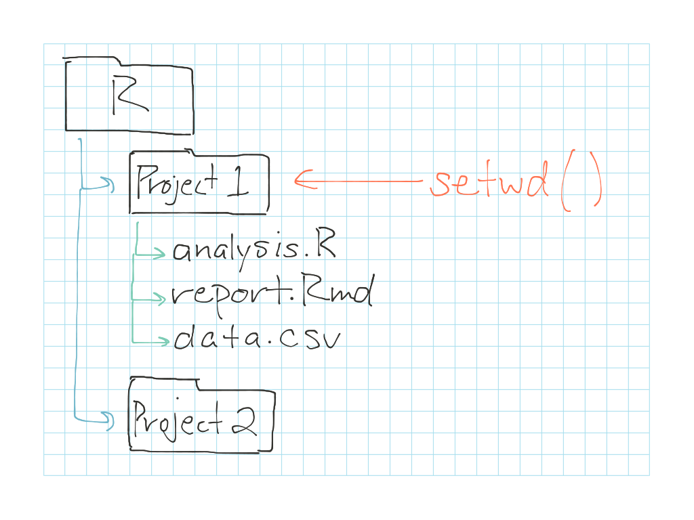
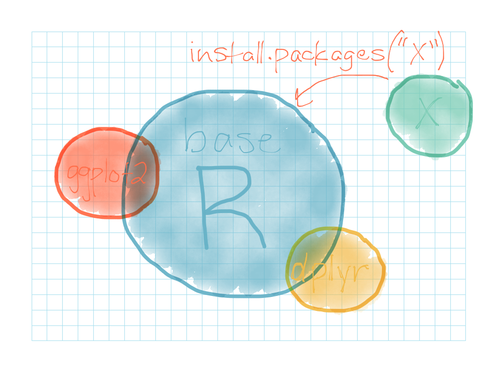

Let's assume you've downloaded R to your computer and are getting all excited to start down the path of learning statistical computing.  You maybe don't quite know what "statistical computing" is--other than that it sounds exciting!  So hopefully you're wondering by now: _What the heck is R?_  Let's start by looking at a really boring definition, and then pick it apart a bit:

> "R is a language and environment for statistical computing and graphics. [...] R provides a wide variety of statistical (linear and nonlinear modelling, classical statistical tests, time-series analysis, classification, clustering, …) and graphical techniques, and is highly extensible. [...] R is available as Free Software under the terms of the Free Software Foundation’s GNU General Public License in source code form."
 
So, what does this mean?...

* **"R is a language and environment for statistical computing":** This means that R doesn't look like Excel or other spreadsheet programs you may be used to.  Instead, R looks a lot more like programming languages such as Python or Java.  With R, you will be using functions and writing code snippets that are very similar to those used in other programming languages, but that have a special emphasis on data analysis and visualization.  (Note: Python, Java, and other programming languages also have data analysis and visualization capabilities, but they are not quite as optimized for these tasks as R is!)

* **"R is highly extensible":** This means that people can write packages for R and share them with other R users.  For example, let's say you wanted to write a package that lets people make graphs and charts that look like web comics.  You could write a packages that does that, and then share it back to the R user community for others to use.  (In fact, this [has already been done](http://xkcd.r-forge.r-project.org/)!)

* **"R is available as Free Software":** This means that there is essentially a large, global group of geeks who is responsible for maintaining and distributing the R software and the various packages that are available for R.  This group is called [CRAN](https://cran.r-project.org/)--the "Comprehensive R Archive Network"--and they distribute the R software to you and other students and scientists around the world for free!  If you have already downloaded R onto your computer, you probably got the software from their website.  R is the result of a massive amount of collaboration and coordination between data geeks around the world!

```{r}
library(xkcd)

# fake exponential growth dataframe
x <- c(1, 2, 3, 4, 5, 6, 7)
y <- sapply(x, function(d) d^2)
xkcd_df <- as.data.frame(cbind(x, y))

# define a bunch of extra variables & tack onto xkcd_df so we can draw XKCD stickfigures
xrange <- range(xkcd_df$x)
yrange <- range(xkcd_df$y)
ratioxy <- diff(xrange) / diff(yrange)

xkcd_df$scale <- 4
xkcd_df$ratioxy = ratioxy
xkcd_df$angleofspine = -pi/2
xkcd_df$anglerighthumerus = -pi/6
xkcd_df$anglelefthumerus = pi + pi/6
xkcd_df$anglerightradius = 0
xkcd_df$angleleftradius = runif(7,- pi/4, pi/4)
xkcd_df$angleleftleg = 3*pi/2 + pi / 12 
xkcd_df$anglerightleg = 3*pi/2 - pi / 12
xkcd_df$angleofneck = runif(7, min = 3 * pi / 2 - pi/10 , max = 3 * pi / 2 + pi/10)
xkcd_df$color=c("1 meh", "2 keep going", "3 a little better", "4 gettin' nifty", "5 pretty decent", "6 awesome", "7 awesome-R")

mapping <- aes(x=x,
y=y+10,
scale=scale,
ratioxy=ratioxy,
angleofspine = angleofspine,
anglerighthumerus = anglerighthumerus,
anglelefthumerus = anglelefthumerus,
anglerightradius = anglerightradius,
angleleftradius = angleleftradius,
anglerightleg = anglerightleg,
angleleftleg = angleleftleg,
angleofneck = angleofneck,
color = color )


p <- ggplot() + geom_path(aes(x, y), data=xkcd_df) +
  xkcdaxis(c(0, 7), c(0, 60)) +
  xlab("Size of R community - measured in number of continents") +
  ylab("Awesomeness of R software") +
  theme_xkcd()

p + xkcdman(mapping, xkcd_df)
```

Now that you have some background on where R comes from and how it is connected to a broader global community, here are some tips you should keep in mind as you get started learning R... 


## 1) Keep your projects organized together in separate folders--this helps R find them.

In general, it is best to create a separate folder for each project you're working on, and keep _all_ of your files for that project within the same folder.  This is because R is very specific in how it looks for files on your computer.  It _always_ starts in what R calls the "working directory".  The working directory is essentially just a folder on your computer that R has flagged to say: "Start here! When you're looking for things, start here first!".  You can also change your working directory whenever you need to, so that R starts looking for files in a different place. 



When you're working on a project, then, the best way to keep track of your files is to keep them all together in a separate folder on your computer.  When you start R Studio, use the **"Files"** tab to navigate into that folder.  Once you're in your project folder in R Studio, select **"More"** > **"Set As Working Directory"** to let R know that you are going to be working on files that are located in that specific folder ("directory").  Do this at the start of each R session, and you will be able to write your R code so that it points directly to these files, and don't have to preface your filenames with long filepath strings in order to locate your files.  

This will make a little more sense later, but for now, just remember to keep your various projects organized in separate folders, and to use RStudio's **"More"** > **"Set As Working Directory"** feature to set your working directory to your project's specific folder each time you open up R Studio.


## 2) The data stays behind the scenes, while you slice and dice your data on the surface.

In a spreadsheet program like Excel, your data is always being displayed in rows and columns right in front of your face.  This works just fine for smaller datasets, when there's not too much data to navigate and scroll through.  But for larger datasets it can be cumbersome to have all of your data piling up in front of you in a spreadsheet!

So in R, things are a little different.  You can load your data into memory on your computer and keep it there for you to be able to analyze and manipulate it.  But your data itself stays behind the scenes.  R doesn't show you the rows and columns of your data unless you _ask_ it to.  

**Pro tip\:** As a general rule, try not to delete anything from your raw data spreadsheet before loading it into R. You don't need to!  The equivalent of "hide columns" in unnecessary in R, because your data remains behind the scenes by default.  Keep your entire dataset, load it into R, and then clean up your data and run analyses directly within R.

In this way, R acts like a kind of "data refrigerator": you can store your dataset in it, and you can open the refrigerator door and peek at your full dataset on occasion.  But you generally want to keep the refrigerator door closed, and only open it up to pick out specific parts of your data that you need when you're ready to use them.  In R Studio, you can see what datasets and other items you have stored in your "refrigerator" by looking at the **"Environment"** tab.

[graphic of R environment "refrigerator", and taking a specific thing out for analysis]

But the data is still always there! Let's prove it to you. You can view your data anytime by clicking on your dataset's name it the **"Environment"** tab in RStudio, or by typing the `View(data)` command into the R console.  Or, you can look at specific parts of your data.  For example:

```{r, eval=FALSE}
# This head() function shows the first few rows of your data
head(data)

# The names() function shows you all of the variable names (column titles) that are present in your data
names(data)

# The str() function shows you additional information about a specific variable in your data
str(data$variable)
```

**Pro tip\:**  When working in R, try to make a "mental snapshot" of what your data table looks like.  In this mental snapshot, make sure to keep track of which variables are quantitative, which variables are qualitative, whether your dataset has any empty values you'll need to account for, etc.  Keep this mental image in mind throughout as you proceed into analysis, and you won't always have to keep peeking back at your full dataset.


## 3) There are always multiple ways to do things--there's never a single right answer!

When you Google questions about R, you may notice that the answers you find online from the user community may use syntax that is less familar to you.  That's because there is rarely ever a sigle "right" way to do things in R.  It's like differences in giving directions to help someone get somewhere: you can tell someone to "take three rights" to get to their destination, which is equivalent to telling them to "take a left".  R functions can be similar--there are often multiple functions you could use to end up with a similar result.

A lot of the reason there are so many ways to do things is because of the fact that R is an amalgam of a lot of different packages, which can use a lot of different types of syntax.  There is a core set of  functions that is available in **"base R"**--the set of tools that comes when you first install R on your computer.  Beyond that, there are multitudes of additional functions and features available in R packages that you can install.



What does this mean for you?  First off, **don't** get frustrated by the variety of ways to do things.  When faced with a choice between approaches, **do** always make an effort to try out a few different possible soutions to a problem and then decide which one is the cleanest and most understandable for your analysis.


## 4) Know the ways to ask for help

### Ask for help() in RStudio

In RStudio, you can use the "Help" tab and to search for information on any R function you have available in base R or in the R packages you have installed.  The "Help" window will explain a little more about specific functions, what they can do, and the arguments and data types they require.  Or, If you're too lazy to click into the "Help" tab in RStudio, you can access the same help information by typing the `help()` command in the R console.  For example, typing `help("table")` will pop up the information on how to create a table using R's "table" function.

Unfortunately, the R help docs can often be tricky to decipher at first.  So, if you're stuck you may need to supplement with an additional help-seeking strategy...

### Learn how to Google for R help

R is such a vast terrain that no single textbook or set of help documents could ever hope to sufficiently cover every angle of R!  Fortunately, R also has a very active user community with a lot of lively online discussions on topics that may be helpful to you.  You should prepare yourself, then, to do a lot of searching online to fill in the gaps when you need help.  

Effective Googling usually starts with knowing the right terminology.  Be patient, and be willing to try searching a lot of different terms, phrases, and synonyms until you find a good combination.  Don't be surprised if you need to try at least 4-5 different searches with different combinations of terms and their synonyms until you start stumbling across helpful search results.

When you're Googling, you may notice that some of the same websites consistently show up in your top search results.  You should make it a goal to find a few good "go-to" R suport websites, and then focus first on those trusted sites when clicking around in your Google search results.  This will help you become much faster when you Google for R help.  Here are a few of the more popular R online support sites you can be on the lookout for when you're Googling:

* Stack Overflow: (http://stackoverflow.com/questions/tagged/r)
* R bloggers: (http://www.r-bloggers.com/)
* Quick-R: (http://www.statmethods.net/)


### Activity A {.activity}

Here is some R-related vocabulary that can be helpful to you when you're searching for help online.  We'll cover these in more detail later, but for now, try to Google these terms (possibly including the word "R" next to them) and see if you can discover what they mean in the context of R:

* package version
* vector
* dataframe
* function
* arguments
* character
* numeric
* logical
* factor


## 5) Expect error messages.  They are your friends. Use the information they give you!

You know the feeling you get when you see a red "Error:" message pop up on your screen?  Your heart starts racing, your palms start sweating, you start asking yourself: "Gah! What did I do wrong?!"  Well, get over it.  Lighten up on yourself.  R is going to throw you lots and _lots_ and **_lots_** of errors and warnings, so get used to it!

When you get an error or warning in your R console, it is because R is trying to be _helpful_.  It is R's way of saying: "Hi there! It looks like something got messed up here. Here's a helpful hint about what I think went wrong."  So when you see an error, one helpful thing you can do is copy and paste the exact error text into Google to see if you can find an online resource that helps explain what went wrong.


### Activity B {.activity}

For example, here's an R expression that yields an error:

```{r}
x <- c("A", "B", "C", "D", "E")
mean(x)
```

Copy and paste the error message into Google and see if you can figure out why R is throwing an error here!


***

**Acknowledgements:** Thanks to Roxanne Johnson for helping to brainstorm some of the topics in this document!
