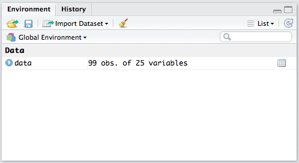
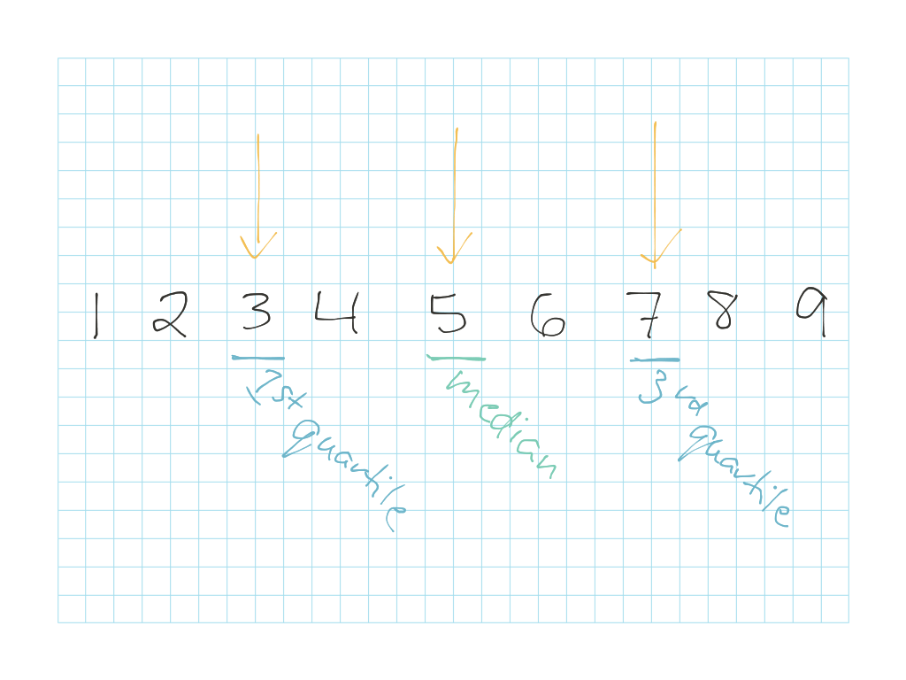

### Objectives {.objectives}

* Learn how to read data from a .CSV file into R and view it in RStudio

* Practice basic R functions to examine the size of a dataset and run basic summary statistics on its variables

***

**Related to:** _Data Computing_, "Tidy Data", p. 9; "Files and Documents", Ch. 4; "Introduction to Data Graphics", p. 47-48


## Exploratory analysis is like a blind date

Sometimes working with a new dataset can feel a little bit like being on a blind date.  You may be a little nervous, because you're not totally sure what your data's deal is.  You may not totally trust it at first, or you may wonder if it's missing certain pieces of information you really care about.  This is good--it's always good to start with healthy skepticism when approaching a new dataset!

A good strategy in these situations is to be ready to ask a lot of questions, and work on piecing together bits and pieces of your data's story.  Don't expect to understand everything at first, but be on the lookout for patterns, trends, or even unexpected details that you can follow up on and explore further later.  Statisticians usually call this "blind dating" process **exploratory analysis**.  So, let's practice asking a few common questions you'll want to ask as you're exploring your data.


## Meet...dataset #1!

Before you can get introduced to your dataset, you'll first need to load it into R.  Generally, it's best to start with datasets that are in **.CSV format** before you load them into R.  CSV stands for "Comma Separated Values", and is a very simple format for raw data where each cell of the data is separated by a comma (",") and each row of data is on a new line of the file.  If you're curious, you can open up your .CSV-formatted dataset in a simple text editor (Windows: Notepad, Mac: TextEdit) to get a better sense of how it's structured.  While it's good to understand what's going on "behind the scenes" in a .CSV file, generally you won't have to actually manipulate your data when it's in this format.  When you load your data into R, the commas in your .CSV file will disappear and will instead appear more like the cells your are used to from spreadsheet programs like Excel.  

For our first "data date", we'll use a sample dataset in a .CSV file called "mpls\_energy\_benchmarking\_2015.csv".  We'll learn more about this data in a minute, but first you'll want to load your .CSV-formatted dataset into R:

1. Use the **"Files"** tab in RStudio navigate to the folder where the dataset is stored.

2. Once you are in the folder and can see your data file listed in the "Files" tab, click the **"More"** settings option, then select **"Set As Working Directory"**. Your working directory should now be set to be the same folder where the dataset is located on your computer.

3. Now, you can use a handy function, `read.csv()`, that lets you easily load a .CSV file into R.  In your R console, type in the read.csv() function command, along with a few arguments: a) The name of your file, surrounded by quotation marks (""); b) The argument `header=TRUE`, to let R know that the dataset contains a header row featuring names for each variable/column in the data; c) An argument called `na.strings` that lists out all values in the original data file that represent missing values (for example: in this dataset, any cell that contains the value "N/A", "Not Available", "NA", or "0" is considered to be a missing value).

```{r}
data <- read.csv("../datasets/mpls_energy_benchmarking_2015.csv", header=TRUE, na.strings=c("N/A", "Not Available", "NA", "0"))
```

When you're done typing this into the console, hit **"Enter"**, and you'll see...nothing!  Or at least, nothing very obvious.  There are two small things you should notice to tell you that your data is successfully loaded: 1) your R console will show you the prompt sign (">") letting you know that it's done processing your request and is ready for a new command; 2) in the **"Environment"** tab in RStudio, you should see your dataset's name listed, along with some basic information about how many observations (rows) and how many variables (columns) your dataset contains.  Click this dataset within your Environment to open up and preview your data in a spreadsheet-like view:



## Read your data's "bio"

If you haven't already, now is the time to look at any **metadata** that is available for your dataset.  Metadata is simply data that provides information about other data.  It's essentially the equivalent of an online dating profile for your dataset--it tells you the "big picture" overview of what your data's all about, and sometimes gives you some specifics about the different variables that are present in the dataset.

This data was found on the City of Minneapolis's website, and [from the metadata](http://www.minneapolismn.gov/environment/energy/benchmarking), we learn that this dataset contains information about energy and water usage in Minneapolis public and large private commercial buildings.  We'll be focusing on a dataset that includes energy benchmarking results for these buildings during the year 2015.  It appears that each row represents a building, and so the columns likely contain various variables relating to each building's energy use over the course of the year.  Now, let's dig in and find out a little more...

## Ask it its names()

R has a lot of convenient commands you can use to examine some basic features of your data _without_ having to open it up and preview your data.   For example, you can find out the names of all of the variables in the dataset using the `names()` function:

```{r, eval=FALSE}
names(data)
```

### Activity A {.activity}

Load in the sample dataset, and then run the `names(data)` command in your R console.  When you run this command, R will spit out a list of 14 variable names into your R console.  What variable names are present in the dataset?  What do you suspect they each mean?  (You can use the metadata to help you make an educated guess about the variable names.)  Pick 4 of the variable names, and write down a brief definition of what you think they measure/represent.


## Check out your data from head() to tail()

You can figure out how many rows and how many columns your dataset has by using the `nrow()` and `ncol()` commands.  Try these and make sure they're the same as the dimensions listed for your dataset in the RStudio "Environment" tab:
```{r, eval=FALSE}
nrow(data)
ncol(data)
```

You can also get a peek at the top ("head") and bottom ("tail") rows of your dataset using the following commands:
```{r, eval=FALSE}
head(data)
tail(data)
```

Or, if you simply want to view _all_ of the data at once, you can **click on your dataset's name in the RStudio "Environment" tab**.  Your data will then pop up in a separate tab along the top of your RStudio window, where you can view its rows and columns in a spreadsheet-like format.  But unlike in spreadsheet programs like Excel, this data viewing tab will be read-only--you _will not_ be able to edit your data here!  Instead, any edits you want to make to your data need to be done using R functions and running them in the R console.  Also note that if you make any edits to your data using R functions, you may need to close and re-open your data viewing tab before you'll be able to see the changes take effect.

## Sum up your data

You can get a quick summary of individual variables/columns in your data using R's handy `summary()` function.  When you type the `summary()` command into the console and hit "Enter", it will spit out some basic descriptive statistics about the specific variable you want to look at.  Here, for example, we're looking at the "year\_built" variable, which describes the years in which the buildings in our dataset were constructed:

```{r}
summary(data$year_built)
```

Some of the statistics--such as minimum, mean, and maximum--should be familiar to you.  You will also see information about the following descriptive statistics:

* **Median\:** This is a measure of the "center" value of the variable, but it's calculated a bit differently from the mean.  If you line up all of the values for the variable in order from lowest to highest, and then take turns crossing off the lowest and highest values from each end of the line, the value you land on in the middle is the "median".  Sometimes the median can be a better measure of center compared to the mean--particularly when there are big outliers--i.e. abnormally large or abnormally small values--present in the data.

* **1st quartile\:** If you divide your variable's values into quarters with equal number of values in each portion, then the 1st quartile is the highest value in the lower quarter of your variable's values.  25% of the full set of values will be less than the 1st quartile value, and 75% of the values will be greater than the 1st quartile value.  You can think of this as a kind of dividing line between value that are "below average" and values that are "way below average".

* **3rd quartile\:** If you divide your variable's values into quarters with equal number of values in each portion, then the 3rd quartile is the lowest value in the upper quarter of your variable's values.  25% of the full set of values will be greater than the 3rd quartile value, and 75% of the values will be less then the 3rd quartile value.  Again, you can think of this as a sort of dividing line between values that are "above average" and values that are "way above average".



### Activity B {.activity}

Pick a different variable in the dataset and run the summary() command on it.  What do you see?  What are the minimum, mean, and maximum values?  What are the 1st quartile, median, and 3rd quartile values? Are there any missing values?  How can you tell?

**Bonus:** We've talked about the "1st quartile" and the "3rd quartile"...what is another name for the "2nd quartile"?


## Learn your data's types

On any decent dating site, you'll see plenty of people who talk about themselves as "dog types" or "cat types", or "outdoorsy types" or "stay-at-home types".  Well, data has its own types, too, and you'll want to start learning more about them as you're getting acquainted with your new dataset!

We dig deeper into data types later, but for now, it doesn't hurt to practice one of the handiest "go-to" functions in R that helps you snoop out R data types: the `str()` function.  This command is short--a mere three little letters--but it's powerful!  If you're confused about a variable, or don't know what type of data it contains, this function tells you exactly how R is interpreting the information in that variable.  For example:

```{r}
str(data$year_built)
```

Here, we can see that R is automatically interpreting the "year\_built" variable to be an "int", which is shorthand for **integer**.  An "integer" is just computer programming speak for a "whole number"; this can be any number, negative, positive, or zero, that does not contain a decimal.  _But how did R know this variable was an integer?!_, you may wonder.  Well, when R read in our data during the read.csv() function, R noticed a lot of whole numbers in the "year\_built" column and simply took its best guess about which data type was present for that variable.


### Activity C {.activity}

Pick a different variable in the dataset and run the `str()` command on it.  What data type does it appear to be?  If you're not sure what it means, try googling "R data type [insert data type here]" and see if you can figure out more about the data type for the variable you picked.

Also note that R sometimes guesses **wrong** about the type of data it thinks is contained in a variable/column.  For the variable you selected, does it seem like R guessed correctly, or did it pick a data type that seems wrong based on your understanding of what the variable is supposed to be measuring?


### Acknowledgements

Thanks to Roxanne Johnson for helping to brainstorm some of the topics in this document!
