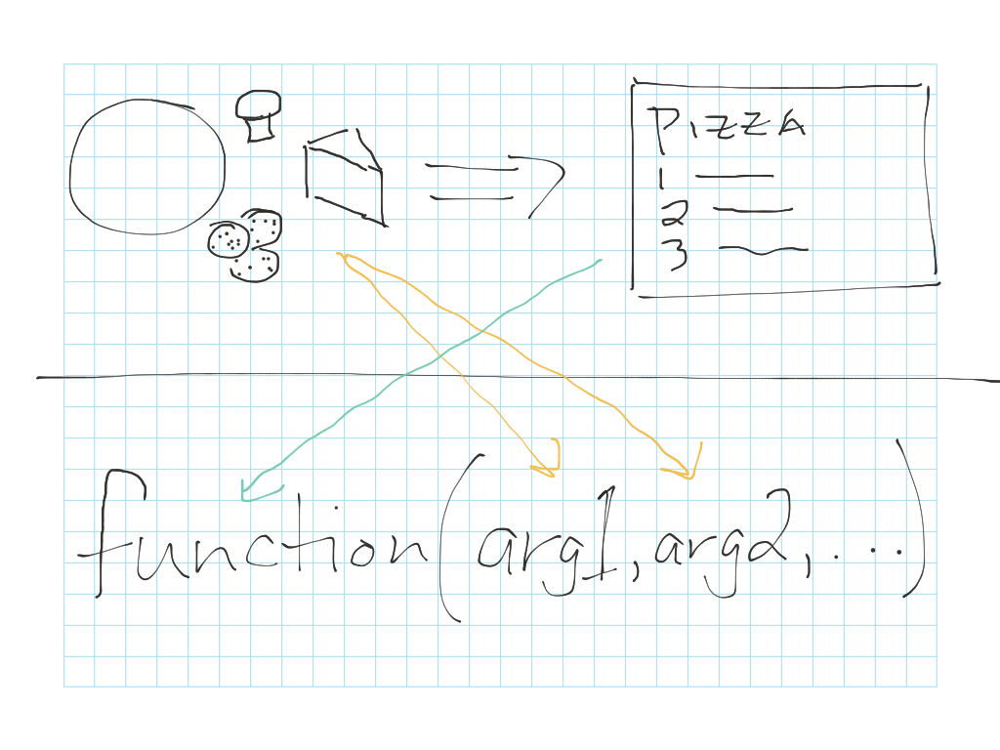
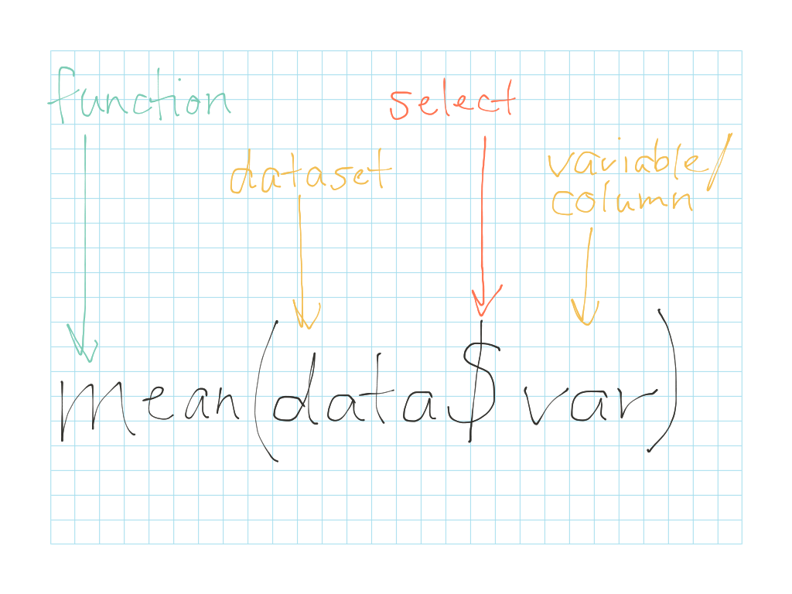
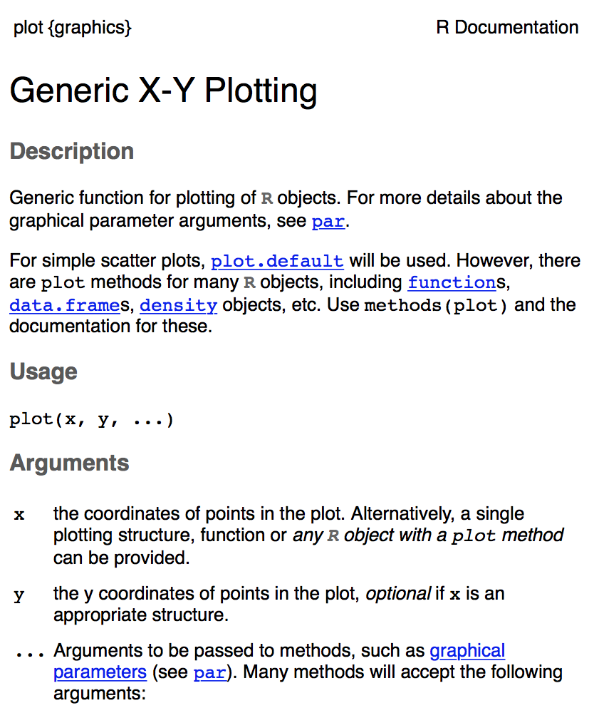
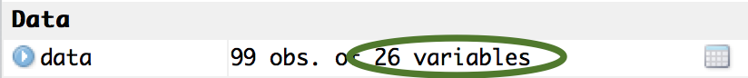

**Related to:** _Data Computing_, "Functions, Arguments and Commands", p. 21; "R Command Patterns", Ch. 3

```{r, echo=FALSE}
data <- read.csv("mpls_benchmarking_2014.csv", header=TRUE, na.strings = c("Not Available", "N/A"))
```

## Functions are R's "recipes" for your data

A **function** in computer programming is like a recipe: it defines a set of inputs, how to combine them, and what will come out in the end.  Similar to a recipe, a function expects you to put in a specific number and type of inputs in order to end with something tasty (in a statistical sense).

The inputs you put into functions are called **arguments**.  If you've ever taken a cooking class, you know that some recipes--like a peanut butter & jelly sandwich--can be very simple and require very few ingredients.  Other recipes--like a pizza--can be more complex, and the number of ingredients can vary a bit based on your preferences.  R functions are similar: some take only one or two arguments, while others can take a whole string of arguments.  A typical R function generally has a small set of required arguments.  Functions may also have additional, optional arguments that you can add on like optional "pizza toppings" when you are calling a function.



#### Pro tip: Wrong thing in, wrong thing out {.pro-tip}
A lot of the errors you'll see in R are caused when you feed the wrong types of arguments into a function.  Functions can be very picky about the type of inputs they're expecting in order to work properly.  For example, if you feed a function a column of numbers (quantitative variable) when its expecting a column of words (qualitative variable), it is likely to spit back an error message in the R console.  It's like baking cupcakes with salt instead of sugar or feeding your dog chocolate for dinner--expect something gross to come out!


### 1-argument function example

Now, let's start by looking at some examples of simple functions that expect either one or multiple arguments so you can get a better sense of how this all fits together in R syntax.  For these examples, we'll be using a dataset describing the energy efficiency of different government and public buildings across the city of Minneapolis.

Simple functions like `mean()`, `sum()`, and `summary()` take a single argument in R.  The structure is generally as follows:



For example, let's look at a basic summary of the "energy\_star\_score" variable in our dataset.  We can use the 1-argument function `summary()` to get a quick and dirty look at the minimum, mean, and maximum values of this variable:

```{r}
summary(data$energy_star_score)
```

### Multiple-argument function example

Once we get beyond 1-argument functions, the world of R starts getting a bit more complex.  Multiple-argument functions typically have some combination of required arguments, along with some additional optional arguments.  For example, the function `plot()` will accept two numeric arguments as inputs and create a scatterplot:

```{r}
plot(data$year_built, data$energy_star_score)
```

The `plot()` function also allows you to add some additional optional inputs to help you style and title the plot:

```{r}
plot(data$year_built, data$energy_star_score, pch=20, main="Scatterplot of Year built vs. Emergy Star rating")
```

You can see we added two arguments: `pch=20` to change the style of the points on the plot, and `main="Scatterplot of Year built vs. Emergy Star rating"` to change the title of the plot.  You wouldn't _have_ to add these optional arguments, but they can help make the plot look a little nicer!


## Using functions

Most importantly, just remember that, for functions, you need the right _number_ and the right _type_ of things going in for the function to, well...function!

The RStudio **"Help"** tab will also help you find instructions for each function describing the different arguments that are both required and optional.  For example, looking at the help doc for the `plot()` function we examined above, we can see that it explains nicely which arguments are required, and what format they need to be in for the function to work properly:




## "Have your cake or eat it?": Calling a function command vs. assigning the result of a function to a variable

What we've been doing up until now is simply _calling_ functions, which gives you a nice, immediate output in the console or in the RStudio **"Plots"** tab.  When you type in a function like the ones shown above and then click "Run" (or hit "Enter"), the result will be spit out into the R console in your RStudio window for you to see.  

But for most data analysis situations, we generally want to assign the result of a function to a variable, so we can save it in our R environment and use the result for later analysis or visualization.

This is kind of similar to having a piece of cake sitting in front of you.  You need to ask yourself: "Do I want to eat this cake now (aka 'call' the function), or save it for later (aka 'assign' the result of a function to a variable)?"

### Assigning to a variable

If you don't want to view your function's output right away, you can save it for later.  For example, for our sample dataset, let's say we want information on the types of buildings that are present in our dataset.  We can use the `table()` function with the following syntax to create a table with this information and save it for later use:

**Example A: Saving the result of a table to a variable**

```{r}
building_types <- table(data$prop_type)
```

To view this table later on, you can simply type its name, "building_types" into the R Console and hit "Enter".  This will print the table into your R Console.

And did you see that?  There's a new symbol in the syntax above.  Meet...the R assignment arrow operator (<-)!  If you've ever looked at other programming languages, you may have used the equals sign (=) for similar purposes to assign a value to a variable.  (In fact, R will also let you use the equals sign (=) in cases like this, but it is not standard practice, so try to stick to the assignment arrow (<-) instead.)

Anytime you use the R assignment arrow operator (<-), the result from the right-hand side of the arrow gets stored under the variable name you give it on the left-hand side of the arrow.  This is stored in your computer's memory and shows up in your RStudio "Environment" tab.  Again, we can think of this "Environment" tab like a giant refrigerator where you can stash away all of your R objects until you're ready to use them.  So at this point, the 'building_types' table is saved in your R environment and is ready to use later on during your analysis.

**Example B: Making a new column**

Another common scenario where assignment is used frequently is when you're creating new columns and tacking them onto your dataset.  For example, let's say you want to calculate how many years ago each building in the dataset was built by subtracting its "year\_built" from the current year.  You then want to save the result as a variable, "years\_ago", into your dataset:

```{r}
data$years_ago <- 2016 - data$year_built
```

Notice that the data didn't originally have a column called 'years\_ago'.  This got created "on the fly" when your declared it as a new column with the name 'years\_ago' on the left-hand side of the assignment.  

This new variable gets appended to the data frame, so you won't actually see it as a separate object showing up in the "Environment" tab.  Instead, it's simply tacked on silently at the end of your data frame.  You should see, however, that the "Environment" tab displays that the number of varibles in your dataset has increased each time you create a new variable and assign it to a new column:




## References

City of Minneapolis. (2012). _Benchmarking Results - CY 2012 Public Buildings_ [Data set]. Retrieved from: http://opendata.minneapolismn.gov/datasets/d050496ced314752bf89763139bc0cb3_0 
