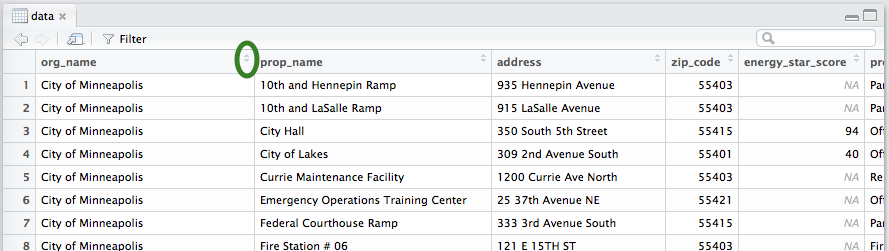

### Objectives {.objectives}

* Produce some basic visualizations (boxplots, histograms, barcharts, and scatterplots) for exploratory analysis using base R functions

* Understand which type of basic visualization is most appropriate to use when addressing various questions you might have about a dataset

***

**Related to:** _Data Computing_, "Introduction to Data Graphics", Ch. 5

[<-- Back to Table of Contents](../index.html){.back-link}


## Time to check out your data's "profile pictures"!

Now we're finally at the point where you can start visualizing your data!  The basic visualizations we'll look at here can be a helpful part of your **exploratory analysis**.  In fact, you can think of them a bit like "profile pictures" for your data: they help you understand how the data looks at various different angles.  (In real dating, you probably would have started looking at profile pictures a little earlier on in the process, but for data dating, we'll save the fun stuff for the second date.)

So, let's start by reading in the data:

```{r, echo=FALSE}
data <- read.csv("../datasets/mpls_energy_benchmarking_2015.csv", header=TRUE, na.strings=c("N/A", "Not Available", "NA", "0"))
```


## Boxplot: The classic "downward camera angle selfie" profile pic

One way you can start sizing up your data is to create some boxplots.  Boxplots are great at giving you a rough estimate of the **spread** of your data: _What is the maximum value for a variable? What is the minimum? Where is the middle (median) value?_  The downside of boxplots is that they only reveal a small set of basic information about your data, but they are a nice place to start before moving onto more complicated plots.

If you remember the `summary()` function we looked at earlier, a boxplot is essentially a visual representation of most of those values: minimum, 1st quartile, median, 3rd quartile, and maximum.  A boxplot is has the following structure:

* **maximum\:** top "whisker" of the plot

* **3rd quartile\:** top of the box

* **median\:** the middle "belt" of the box

* **1st quartile\:** bottom of the box

* **minimum\:** bottom "whisker" of the box

For example, let's say you want to understand more about the range of scores our buildings received on the "energy\_star\_score" variable.  You can create a boxplot for this variable using the `boxplot()` function.  When you're done, you should see a boxplot indicating that the median Energy Star score for the buildings in our dataset is about 75, and the 1st and 3rd quartile scores are about 50 and 90, respectively:

```{r}
boxplot(data$energy_star_score)
```

You can also group your boxplot, to examine how values vary between groups.  For example, we have a variable called "org\_name" in our buildings dataset that indicates which organization is responsible for managing the building (or, if it's a private building, it simply lists "Private").  Maybe we're wondering how a building's Energy Star rating tends to vary based on the organization that the building is affiliated with.  Let's group buildings with the same "org\_name" together, then, and see how that changes our boxplox:

```{r, fig.width=16, fig.height=8}
boxplot(data$energy_star_score ~ data$org_name)
```

If your plot is too small to view in RStudio, or if it looks like parts of the plot are scrunched together, you can click the **"Zoom"** button directly above the plot to open up a new window with a zoomed-in version of the plot.  One the zoom window is open, you can also stretch and shrink the size of the window to stretch and shrink the plot.

Looking at the plot above, it seems that Hennepin County buildings tend to have higher Energy Star scores than any of the other groups of buildings.  _But wait a minute...that boxplot has an empty space in it!_ you may be saying.  And you're right: the "Minneapolis Park and Recreation Board" has no associated boxplot in the chart you just created.  This could be for one of two reasons: 1) there are not enough building observations within the "Minneapolis Park and Recreation Board" group to able to calculate a meaningful boxplot, or 2) there are missing values ("NA") within the group.  In general, you need _two or more non-missing values for each group in your dataset_ in order to create a boxplot for each group.  If this isn't the case, your grouped boxplot will be missing values.  So, let's try to figure out what is going on.  

First, you can use the `table()` function to check to see how many buldings in the dataset fall within each "org\_name" group:

```{r, eval=FALSE}
table(data$org_name)
```

After you run the command above, you should see that there are 49 buildings that are affiliated with the "Minneapolis Park and Recreation Board".  That _should_ be enough to create a boxplot, so clearly there is something else going on.  Next, you can view your data by clicking on the name of your dataset from the **"Environment"** tab inside of RStudio.  This will open up a preview tab where you can view the data.  Click the sort arrows next to "org\_name" to sort your data based on the "org\_name" variable:



Finally, scroll down and look for the buildings that are affiliated with the "Minneapolis Park and Recreation Board": what do you see in the "energy\_star\_score" column for these buildings?  It looks like most of them are missing values ("NA").  For some reason, it seems that Minneapolis Park and Recreation Board buildings _do not_ generally receive "energy\_star\_score" ratings.  That explains why you don't see a boxplot for this group of buildings in the grouped boxplot you just created!

This is a good lesson: anytime you group your data based on a variable like this, it's always good to check how many values fall into each group before plotting or doing further analysis.  If you don't have enough observations in a particular group, or you have missing observations within the group, you will need to account for that during your analysis. 

### Activity A: Practice the table() function and examine missing values {.activity}

Use the `table()` function again, this time on the `data$prop_type`.  Using the same process above, try to decide: would you be able to create a grouped boxplot displaying the "energy\_star\_score" distribution for buildings whose "prop\_type" is "Parking"?  Why or why not?  How about buildings whose "prop\_type" is "Fire Station"?  Why or why not?


## Histogram: The full-body mirror shot

Another way of examining your data is to look at a histogram, which helps you learn more about both the spread and the shape of your data: _What values are most common in the data?  What values are rare in the data?  Do most of the values fall in the middle, or do they lie on separate extremes of the data's range?_   A histogram reveals some of the same basic information a boxplot can show you, plus some additional information about the data's shape.  Here's a quick comparison between boxplots and histograms, and how to interpret the minimum, 1st quartile, median, 3rd quartile, and maxiumum values on each:


A histogram is also particularly helpful for recognizing if your data is **multimodal**.  In fact, when creating histograms, it may be helpful to think of variables a bit like camels--yes, the camels that walk in the desert!  You may have learned as a child that some types of camels have one hump while others have two.  Well, variable distributions are similar: some variables will have one "hump", while other variables will have two "humps" when you plot them as a histogram.  (Some variables--and possibly also some camels?--may have _more than_ two "humps", but this is relatively rare.)  In particular, you should be on the lookout for variables with two "humps"--or **bimodal** variables--as these variables may require special treatment in later analysis.

For example, let's say we want to understand more about the shape of the distribution of scores our buildings received on the "energy\_star\_score" variable.  Here's how you can create a histogram in R:

```{r}
hist(data$energy_star_score)
```

You can see above that the data appears somewhat multimodal--or just generally kind of distorted, with more observations near the very low end and the mid- to high end of the histogram.  It is not a nice, smooth curve that peaks in the middle.  Again, you can use the `table()` function to understand a little more about what's going on.  Looking at the results of `table`, you can get a count of how many observations in the dataset fall under each particular score:

```{r}
table(data$energy_star_score)
```

You can also count the number of rows in the data set that have a missing value for their "energy\_star\_score".  You can use the `is.na()` function to find which rows have an "energy\_star\_score" that is equal to "NA", and then use the `sum()` function to count them:
```{r}
sum(is.na(data$energy_star_score))
```

You can see, then, that a total of 189 buildings in the dataset are missing an Energy Star score.  That means that around half of the buildings on the dataset do not have an Energy Star score, and will not be included in the Energy Star score histogram you just plotted!  This is important to keep in mind as you're analyzing your data; the presence of this many missing values is something you should make sure to mention when writing up any kind of report or analysis about the buildings' Energy Star scores. 


## Barchart: The pic wearing formal attire

A barchart is another common way to visualize data, and is particularly useful for displaying counts of **categorical variables**.  A barchart doesn't work for all occasions, though: it should generally be used with variables whose values can be tidily divided up into categories or groups, where you want to get a sense of how many observations fall within each group.  For example, the "org\_name" variable describing the organizations affiliated with the various buildings in our dataset is a good example of a categorical variable.  

To display the data as a barchart, you must first create a table to keep track of the counts of how many observations fall within each category/group of the variable you're interested in:
```{r}
building_org_name_counts <- table(data$org_name)
```

Then, you can use the `barplot()` function to plot these counts as a barchart:
```{r, fig.width=16, fig.height=8}
barplot(building_org_name_counts)
```


## Scatterplot: The "I went on vacation and have awesome stories to tell about it" pic

One final way of visualizing data is a scatterplot, which is particularly useful for comparing two numeric variables to see how they may relate to each other.  A scatterplot can also be a very simple way of telling a data "story" relating two variables.  You generally want to pick one of the variables to plot along the bottom (X) axis of the scatterplot--this should be what we call the **independent variable** or **explanatory variable**.  It's best to put along the X axis the variable that you think _explains_ the most about why the data is shaped the way it is.  The other variable--along the vertical (Y) axis of the scatterplot--then becomes the **dependent variable** or **response variable**.  This is the variable that you think is most likely a result/response to the pattern observed in the explanatory (X) variable.

For example, let's say you think that the age of a building is likely to influence/explain the building's Energy Star score.  You suspect that energy-saving technologies have been improving in recent years, so it seems like a reasonable hypothesis that newer buildings would receive higher Energy Star scores.  If this is your theory, you would want to choose "year\_built" as the explanatory (X) variable, and "energy\_star\_score" as the response (Y) variable in your plot.  

Here's how you can use a scatterplot to compare the buildings' "year\_built" (along the X axis) to the buildings' "energy\_star\_score" (along the Y axis):

```{r}
plot(data$energy_star_score ~ data$year_built)
```

Now, looking at the plot above, you can see that there _does not_ appear to be a strong relationship between the year the buildings were built and their respective Energy Star scores.  Newer buildings _do not_ seem to have consistently higher scores than older buildings.  In fact, there are many new buildings with low- or mid-range Energy Star scores, and plenty of older buildings with high Energy Star scores.  Part of this could be due to the large number of missing values in the "energy\_star_\score" variable, as noted above.  For example, it is possible that buildings that would be prone to earning lower Energy Star scores choose not to get an Energy Star ranking in the first place, or choose not to report their scores when being surveyed for this dataset.

Scatterplots, then, may surprise you by revealing unexpected relationships--or _lack_ of relationships--between variables.  Use scatterplots as a nice way to test theories you may have about the relationship between different variables and help you decide which theories to reject, and which theories are worth examining in further analysis.

#### Pro tip: X or Y? Y or X? {.pro-tip}
If you're having trouble figuring out which variable to choose as X and Y in the example above, just try to reverse the question: does it seem likely that a building's Energy Star score could _change_ or _influence_ the year that a building was built?  No--this is clearly not possible!  Buildings are built whenever they're built, and the resulting Energy Star score, then, may or may not be influenced by the building's age.  So the year built should act as the explanatory (X) variable, and the Energy Star score becomes the response (Y) variable.

For exploratory analysis, it's not always hugely important which variable you choose to plot as X and which you choose for Y.  You're exploring, after all, so you may not yet have a good sense of which variable you think is doing the influencing and which is doing the responding.  But for your final analyses, as you _do_ gain a stronger theory how your variables are related, try to pick the right variables for the right axes--while also recognizing that there's not always a "right" answer, and your choice is sometimes more of an art than a science.


### Activity B: Pick your plot {.activity}

In general, you should look at plots as a way to help you start answering questions about your data.  But it's important to find the right plot for the job, since some plots are better for answering certain questions than others!  For each of the questions below, pick a plot type from the ones discussed above (boxplot, histogram, barchart, scatterplot) that you think could best address the question.  Then, try to create a plot that you think helps address each question:

1. How many of each type of building ("prop\_type") are present in the dataset?

2. In approximately what year was the oldest building in the dataset built?  The newest building?

3. Is there a relationship between the amount of floor area in a building ("floor\_area") and its greenhouse gas emissions ("total\_GHG\_emissions")?

4. When it comes to site energy use intensity ("site_EUI"), does the dataset tend to have buildings that fall towards the extremes of the spectrum (i.e. many buildings with extremely high or extremely low site energy use intensity measures)?  Or do most buildings in the dataset fall somewhere in the middle?


### Acknowledgements

Thanks to Roxanne Johnson for helping to brainstorm some of the topics in this document!
