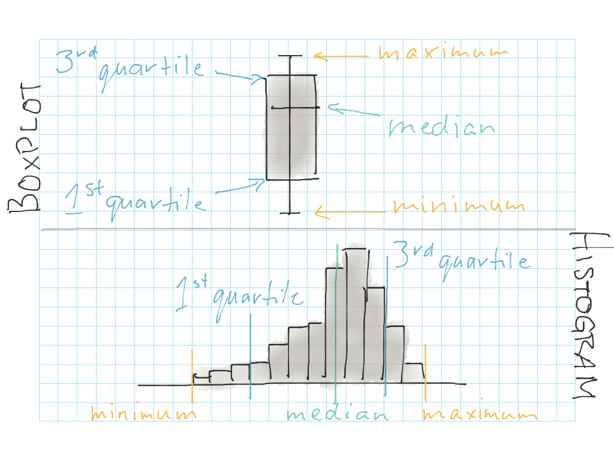

***

**Related to:** _Data Computing_, "Introduction to Data Graphics", Ch. 5

***

```{r, echo=FALSE}
data <- read.csv("Benchmarking_Results__CY_2012_Public_Buildings.csv", header=TRUE, na.strings=c("N/A", "Not Available"))
```

So, now we're finally at the point where you can start visualizing your data!  The basic visualizations we'll look at here can be a helpful part of your **exploratory analysis**.  In fact, you can think of them a bit like "profile pictures" for your data: they help you understand how the data looks at various different angles.  (In real dating, you probably would have started looking at profile pictures a little earlier on in the process, but for data dating, we'll save the fun stuff for the second date.)


## Boxplot: The classic "downward camera angle selfie" profile pic

One way you can start sizing up your data is to create some boxplots.  Boxplots are great at giving you a rough estimate of the **spread** of your data: _What is the maximum value for a variable? What is the minimum? Where is the middle (median) value?_  The downside of boxplots is that they only reveal a small set of basic information about your data, but they are a nice place to start before moving onto more complicated plots.

If you remember the `summary()` function we looked at earlier, a boxplot is essentially a visual representation of most of those values: minimum, 1st quartile, median, 3rd quartile, and maximum.  A boxplot is has the following structure:

* **maximum\:** top "whisker" of the plot

* **3rd quartile\:** top of the box

* **median\:** the middle "belt" of the box

* **1st quartile\:** bottom of the box

* **minimum\:** bottom "whisker" of the box

Here's how you create a boxplot in R for a single variable.  For example, let's say we want to understand more about the range of scores our buildings received on the "ENERGY\_STAR\_score" variable:

```{r}
boxplot(data$ENERGY_STAR_score)
```

You can also group your boxplot, to examine how values vary between groups.  For example, we have a variable called "Prop\_Type" in our dataset that describes whether the building is a school, office, parking lot, etc.  Maybe we're wondering how the Energy Star rating tends to vary based on property type.  Let's group buildings with the same "Prop\_Type" together, then, and see how that changes our boxplot:

```{r}
par(las=2, mar=c(10, 4, 2, 2))
boxplot(data$ENERGY_STAR_score ~ data$Prop_Type)
```

_Wait a minute...that boxplot looks kind of empty!_ you may be saying.  And you're right: there are clearly values on the chart that have no associated boxplot (for example: "Convention Center").  This is generally because there are not enough values in those group to be able to calculate a meaningful boxplot--there's only one Convention Center in Minneapolis, after all!  This is a good lesson: when grouping based on a variable like this, it's always good to check how many values fall into each group before plotting or doing further analysis.  If you don't have enough observations in a particular group, you will need to account for that during your analysis.  You can see how many obeservations fall in each "Prop_Type" group using the `table()` function:

```{r, eval=FALSE}
table(data$Prop_Type)
```

### Activity A {.activity}

Use the `table()` function to find out: how many parking lots do we have in this dataset?  Parking lots also don't have a boxplot associated with them in the chart above.  Why do you think that is?  (Hint: View your full dataset to help you come up with a theory.)


## Histogram: The full-body mirror shot

Another way of examining your data is to look at a histogram, which helps you learn more about both the spread and the shape of your data: _What values are most common in the data?  What values are rare in the data?  Do most of the values fall in the middle, or do they lie on separate extremes of the data's range?_   A histogram reveals some of the same basic information a boxplot can show you, plus some additional information about the data's shape:



A histogram is also particularly helpful for recognizing if your data is **multimodal**.  In fact, when creating histograms, it may be helpful to think of variables a bit like camels--yes, the camels that walk in the desert!  You may have learned as a child that some types of camels have one hump while others have two.  Well, variable distributions are similar: some variables will have one "hump", while other variables will have two "humps" when you plot them as a histogram.  (Some variables--and possibly also some camels?--may have _more than_ two "humps", but this is relatively rare.)  In particular, you should be on the lookout for variables with two "humps"--or **bimodal** variables--as these variables may require special treatment in later analysis.

For example, let's say we want to understand more about the shape of the distribution of scores our buildings received on the "ENERGY\_STAR\_score" variable.  Here's how you create a histogram in R:

```{r}
hist(data$ENERGY_STAR_score)
```

You can see above that the data appears multimodal--or just generally kind of distorted.  It is not a nice, smooth curve that peaks in the middle.  For some reason, there appears to be a large number of buildings that received very low scores.  Again, you can use the `table()` function to understand a little more about what's going on.  Looking at the results of `table`, you can get a count of how many observations in the dataset fall under each particular score:

```{r}
table(data$ENERGY_STAR_score)
```

Here, it looks like there are 13 buildings with a score of "0"!  This is likely a data quality issue, and is something you will want to keep in mind during further analysis.


## Barchart: The pic wearing formal attire

A barchart is another common way of visualizing data, and is particularly useful for displaying counts of **categorical variables**.  A barchart doesn't work for all occasions, though: it should generally be used with variables whose values can be tidily divided up into categories or groups, where you want to get a sense of how many observations fall within each group.  For example, the "Prop_Type" variable describing the property types of the various buildings in our dataset is a good example of a categorical variable.  Here's how you can display that data as a barchart:

```{r}
building_type_counts <- table(data$Prop_Type)
barplot(building_type_counts)
```


## Scatterplot: The "I went on vacation and have awesome stories to tell about it" pic

One final way of visualizing data is a scatterplot, which is particularly useful for comparing two numeric variables to see how they may relate to each other.  A scatterplot can also be a very simple way of telling a data "story" relating two variables.  You generally want to pick one of the variables to plot along the bottom (X) axis of the scatterplot--this should be what we call the **independent variable** or **explanatory variable**.  It's best to put along the X axis the variable that you think _explains_ the most about why the data is shaped the way it is.  The other variable--along the vertical (Y) axis of the scatterplot--then becomes the **dependent variable** or **response variable**.  This is the variable that you think is most likely a result/response to the pattern observed in the explanatory (X) variable.

For example, let's say you think--quite reasonably!--that the age of a building is likely to influence/explain the building's Energy Star score.  You would want to choose "ENERGY\_STAR\_score" as the explanatory (X) variable, and "Year\_Built" as the response (Y) variable in your plot.  If you're having trouble figuring out which variable to choose as X and Y, just try to reverse the question: does it seem likely that a building's Energy Star score could _change_ or _influence_ the year that a building was built?  No--this is clearly not possible!  Buildings are built whenever they're built, and the resulting Energy Star score, then, may or may not be influenced by the building's age.  So the year built should act as the explanatory (X) variable, and the Energy Star score becomes the response (Y) variable.

Here's how you can use a scatterplot to compare the buildings' "Year\_Built" (along the X axis) to the buildings' "ENERGY\_STAR\_score" (along the Y axis):

```{r}
plot(data$Year_Built ~ data$ENERGY_STAR_score)
```

#### Pro tip: X or Y? Y or X? {.pro-tip}
For exploratory analysis, it's not always hugely important which variable you choose to plot as X and which you choose for Y.  You're exploring, after all, so you may not yet have a good sense of which variable you think is doing the influencing and which is doing the responding.  But for your final analyses, as you _do_ gain a stronger theory how your variables are related, try to pick the right variables for the right axes--while also recognizing that there's not always a "right" answer, and your choice is sometimes more of an art than a science.


### Activity B {.activity}

In general, you should look at plots as a way to help you start answering questions about your data.  But it's important to find the right plot for the job, since some plots are better for answering certain questions than others!  For each of the questions below, pick a plot type from the ones discussed above (boxplot, histogram, barchart, scatterplot) that you think could best address the question:

1. How many of each type of building are present in the dataset?

2. In approximately what year was the oldest building in the dataset built?  The newest building?

3. Is there a relationship between the amount of floor area in a building ("Prop\_Flr\_Area") and its energy use intensity ("Site_EUI")?

4. When it comes to Energy Star ratings, does the dataset tend to have buildings that fall towards the extremes of the spectrum (i.e. many buildings with extremely high or extremely low Energy Star ratings)?  Or do most buildings in the dataset fall somewhere in the middle?


## References

City of Minneapolis. (2012). _Benchmarking Results - CY 2012 Public Buildings_ [Data set]. Retrieved from: http://opendata.minneapolismn.gov/datasets/d050496ced314752bf89763139bc0cb3_0 


***

**Acknowledgements:** Thanks to Roxanne Johnson for helping to brainstorm some of the topics in this document!
