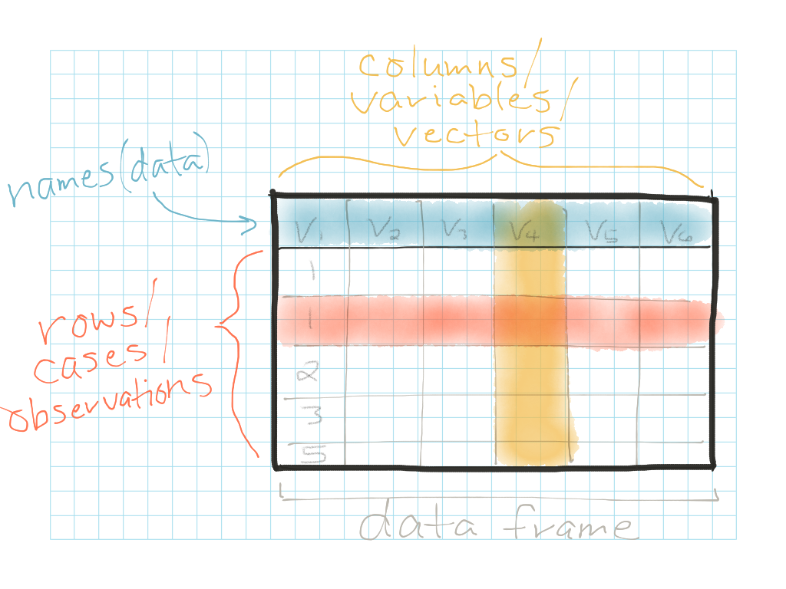
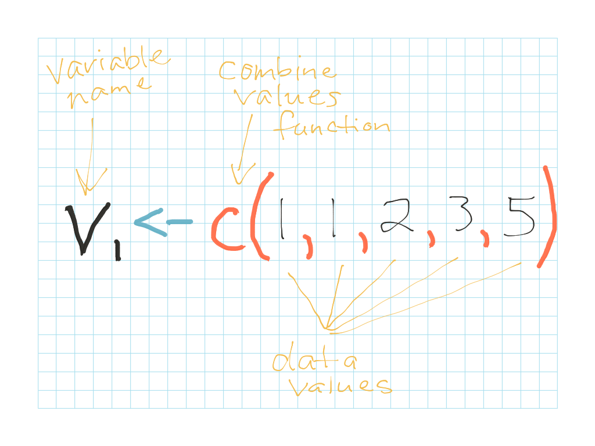

### Objectives {.objectives}

* Understand how R holds information in spreadsheet-like **data frames** that are comprised of **vectors**

* Understand R's five basic data types--**character, numeric, integer, logical, factor**--the formal structures R uses to hold data values.  Get a sense of which types of values each data type is best used for.

* Create a data frame "from scratch" by creating vectors containing different data types and combining them into a single data frame

***

**Related to:** _Data Computing_ p. 29

[<-- Back to Table of Contents](../index.html){.back-link}


## Data structures: The "building blocks" of R

### Data frames

Data frames are one of R's most useful structures for organizing and manipulating data.  They are the basic organizational structure you'll use for most data analyses.  In fact, you've already encountered data frames: whenever you use the function `read.csv()`, R automatically converts your data to a data frame behind the scenes and stores it into your R environment for you to work with.

You can think of data frames as similar to a spreadsheet in Excel.  Data frames contain **rows** representing specific cases or observations in the dataset.  Data frames also contain **columns** representing measurements for each observation along different variables.




### Vectors (aka "variables" or "columns")

The columns of a data frame contain another R data type: vectors.  Anytime you take single column/variable of a data frame and do some analysis on it, you are usually working with a **vector**.  

For example, here's the first column/vector of the example data frame above singled out on its own:



This may look a little strange at first--especially since the vector appears horizontal, not vertical, when it's singled out on its own.  This is simply because R tends to display things horizontally so that they are easier to view in the R console.  But don't be fooled by appearances!  

Try to visualize in your mind how this single vector, when turned vertially and combined with other vectors, can fit within a larger data frame.  A data frame is simply multiple vectors/variables stacked next to each other vertically!  This may sound a little abstract for now, but we'll look at an example in a minute that should help clarify how vectors come together to make a data frame.  But first, we need to understand: _What goes **inside of** our vectors?_


## Data types: The "flavors" of data

Each vector has a different "flavor"--or **data type**--that describes what kind of information the vector/variable holds.  Data types in R are important, because they affect what types of analyses you can perform on each variable.  For example, it's not too hard to create a scatterplot or histogram containing information about the "year\built" variable you encountered in the Minneapolis buildings energy efficiency dataset, since scatterplots and histograms are both visual displays that are appropriate for **numeric** data.  

But how would you plot data about, say, the _names_ of each building in our dataset?  Names are **character** data type, so they wouldn't make sense in a histogram or scatterplot--you'd need to use an alternative visualization, like a wordcloud.

To help understand the different data types used in R, let's take an example: let's say you're organizing a baseball tournament, and you need to keep track of information about participants in your tournament.  Here are examples of each of the main data types in R, along with an example or two of variables that fall within that data type that might be relevant for your baseball tournament: 

R data type     | What type of data does it contain? | Example
--------------- | ---------------------------------- | -----------------------------------
**Character ("chr")** | letters and other text characters (aka "strings" in programming speak) | players' first and last names
**Numeric ("num")**   | numbers, including negative numbers and numbers with decimal points    | weight, height
**Integer ("int")**   | similar to numeric, but for whole numbers, including negative whole numbers | age, social security number
**Logical ("logi")**  | information on true/false questions                                     | "this person has participated before", "this person is a vegetarian"
**Factor**            | unordered _or_ ordered categorical information                          | team they're on (unordered categorical variable); T-shirt size (S, M, L, XL) (ordered categorical variable)

### Activity A: Thinking about data types {.activity}

For each of the data types in the table above, come up with at least one other example of a variable that falls within that data type.  Sometimes it's not completely clear what data type a variable best fits within, which means you'll need to make a reasonable judgement call.  Explain your choices, where necessary.


## Putting it together: Make your own data frame!

Now, let's say you want to format all of the information for your hypothetical baseball tournament into an R data table.  Let's construct a data frame from scratch containing all of the information on the players in your tournament.  _Note:_ It's very rare that you would have to create a data table from scratch like this--in general, you're more likely to have to _pick apart_ a data table into its component vectors during a data analysis!  Think of this exercise, then, as essentially "working backwards" to help you understand the inner workings of data tables and the vectors they contain so you can pick them apart more effectively during data analyses.

Creating a vector is pretty straightforward: you need to wrap the vector in `c()`, which is a way of telling R to "join these things together into a vector!".  And then, within each vector, you need to separate out your data values using commas (",").  For character and most factor vectors, you also need to surround each data value with quotation marks ("").  Let's create several vectors of different data types, each of which holds various pieces of information about 5 of the players in the tournament:

```{r}
# Character vector
player_name <- c("Abdi", "Brit", "Chloe", "Dani", "Ed")

# Numeric vector
player_weight <- c(150.5, 220.8, 135.2, 125.1, 180.2)

# Integer vector
player_age <- c(18, 20, 24, 19, 22)

# Logical vector
vegetarian <- c(TRUE, FALSE, FALSE, TRUE, FALSE)

# Factor vector
tshirt_size <- factor(c("L", "XL", "S", "S", "M"), levels=c("S", "M", "L", "XL"))
```

Now that you have several vectors of different data types containing information on your baseball tournament players, you're ready to combine these variables into a data frame:

```{r}
baseball_tournament_df <- data.frame(player_name, player_weight, player_age, vegetarian, tshirt_size)
```

Your baseball tournament data frame should now be saved into your R "Environment" tab in RStudio.  Click on it to make sure it's formatted correctly and looks like a table full of data!


#### Pro tip: Factors are special {.pro-tip}
The only difference you should have noticed among the vectors above is that the **factor vector** requires one extra piece of information: it needs you to add some information about the _levels_ for the variable.  This is because R isn't smart enough to know much about t-shirt sizes, so you need to tell it which size represents the smallest t-shirt and which size represents the largest.  If we don't add any information about these "levels", R will simply assume an alphabetical ordering, which means it will assume that t-shirts come in sizes "L", "M", "S", "XL"--in that order!  To help avoid this confusion, you need to directly specify the order of the levels for ordered categorial variables.  

Also note that behind the scenes, R is secretly splitting this factor into to parts: 1) a text value ("S", "M", "L", "XL"); 2) a number (1, 2, 3, 4) representing the numeric order each of these values.  If you run the `str()` function on this vector, you can get a sense of what's going on under the surface:

```{r}
str(tshirt_size)
```


### Activity B: Create your own data frame {.activity}

Now that you've made a sample data frame based on baseball tournament participant data, create another sample data frame for a topic of your choice.  Include at least one of each of the 5 vector types mentioned above.


## Converting between data types

Sometimes there are situations where you'll want to _convert_ vectors of data into different data types.  For example, when reading in data using `read.csv()`, R sometimes guesses wrong when automatically selecting data types for the variables in your data frame.  This is one of the most common reasons you may need to convert your vectors into different data types.  And unfortunately, you may not even notice this at first!  Generally, it takes a few strange error messages before you figure out that something has gone awry.  

If you're getting unexpected error messages when you think you're doing things correctly, try the `str()` function on your variables to see what data type R is treating them as:
```{r, eval=FALSE}
str(data$variable)
```

You may notice, for example, that R is mistaking numbers for characters, or characters for factors, or some other similar identity mix-up.  If this happens to you, here are some conversion functions you can use to convert a vector/variable into the data type you need:

```{r, eval=FALSE}
as.character(data$variable)
as.numeric(data$variable)
as.integer(data$variable)
as.logical(data$variable)
as.factor(data$variable, levels=c(...))
```

#### Pro tip: Use data type information when Googling {.pro-tip}
Some R functions only work on specific data types.  When Googling, if you're trying to do a specific thing with a specific vector, include as much information as you can about its data type for better results.  For example: "plot numeric vector", "count factor vector", "visualize character vector", etc.


### Activity C: Exploring factor variables {.activity}

Run the following data type conversions on the `baseball_tournament_df$tshirt_size` vector.  What do you see?  Why do you think you're getting different results for `as.numeric()` and `as.character()` conversion?  What is going on here?

```{r, eval=FALSE}
as.numeric(baseball_tournament_df$tshirt_size)
as.character(baseball_tournament_df$tshirt_size)
```


#### Pro tip: Other data types! {.pro-tip}

Beyond data frames and the vectors that they contain, R also has other data structures.  The most common of these are: 

* **matrix (plural: matrices)**: These are similar to data frames, but are a little less flexible because they require all columns to contain the same type of data.  

* **lists**: Lists are similar to vectors, but can hold irregularly-shaped data.  For example, a list can hold data elements of different types 

We won't worry too much about these data structures for now, because you are unlikely to need them for the types of analyses you'll be working on.  The terms "matrix" and "list" may, however, be helpful vocabulary to know as you're Googling around for R help.
