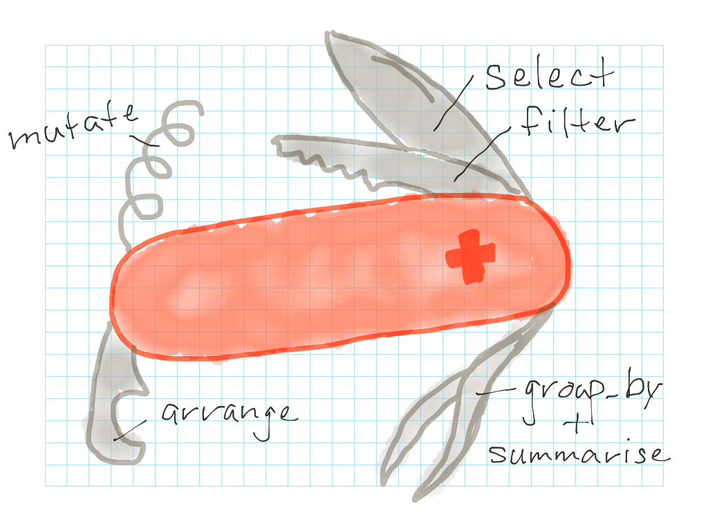
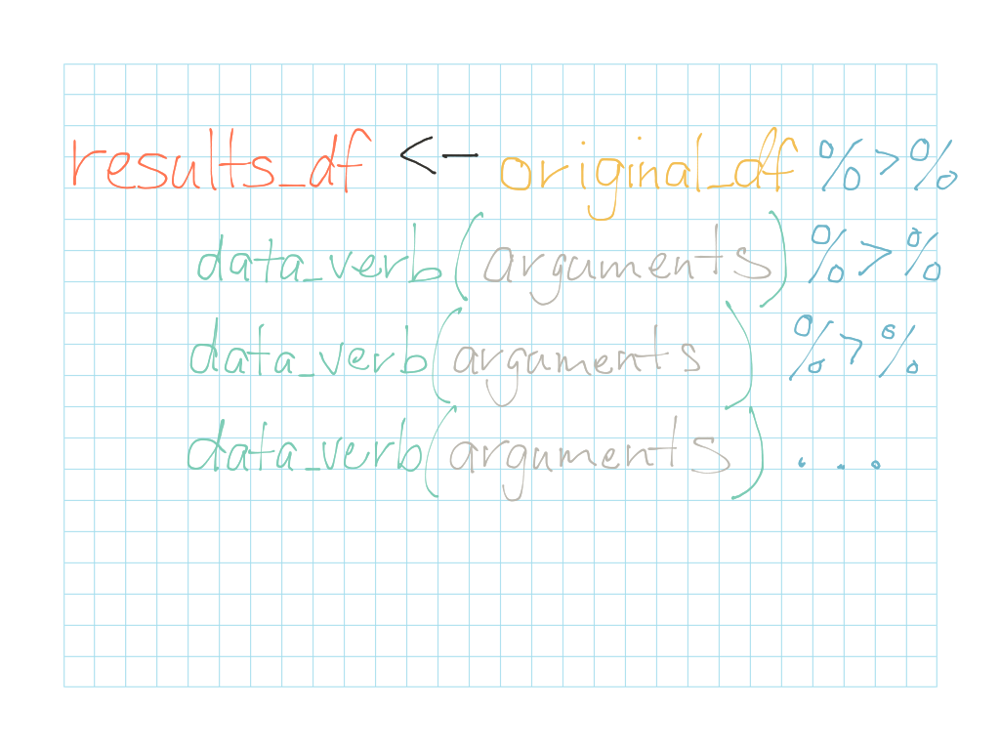

***

**Related to:** _Data Computing_, "Wrangling and Data Verbs", Ch. 7; "More Data Verbs", Ch. 9

***

## dplyr: R's Swiss Army Knife

We're going to look now at one of R's handiest libraries for cleaning, sorting, shaping, filtering, and just generally "wrangling" your data: dplyr!  The dplyr library offers you a bunch of different functions for slicing and processing your data into formats that are easier for you to work with.  You can think of it like a "Swiss army knife" of data management in R: it has lot of different tools that let you cut up, slice up, and reshape your data in different ways.



You may notice from the graphic above that each of the tools dplyr offers--`select()`, `filter()`, `mutate()`, `arrange()`, `group_by()`, and `summarise()`--is a function named after some kind of verb related to data manipulation.  This is why these dplyr functions are also sometimes referred to as **data verbs**.  We'll look at what each of these verbs does in a minute, but first, to get started with dplyr, you'll need to make sure to install it the first time you use it:

```{r, eval=FALSE}
install.packages("dplyr")
```

After dplyr is successfully installed, every time you want to use it, just make sure to load the library by running the following line of code at the beginning of your project.  Generally, you should only need to run this once at the beginning of each R project or session:

```{r, warning=FALSE, message=FALSE}
library(dplyr)
```


Now that you have dplyr loaded, let's have another look at our baseball tournament dataset, this time with a few additional players and a few additional variables.  Load the following into your R environment and then we'll start getting acquainted with some ways to wrangle this data using dplyr:
```{r}
# Character vector
player_name <- c("Abdi", "Brit", "Chloe", "Dani", "Ed", "Fatosh", "Greg", "Hannah", "Isaak", "Jo", "Kasey", "Laura", "Maunela", "Nate", "Olive", "Penelope", "Quince", "Ralf", "Sara", "Theo", "Ursula", "Vince", "Wil", "Xander", "Yolanda", "Zeus")

team_name <- c("Dolphins", "Jets", "Sharks", "Jets", "Dolphins", "Sharks", "Dolphins", "Sharks", "Sharks", "Jets", "Sharks", "Dolphins", "Dolphins", "Sharks", "Dolphins", "Jets", "Dolphins", "Jets", "Sharks", "Jets", "Jets", "Dolphins", "Sharks", "Dolphins", "Jets", "Sharks")

# Numeric vector
player_weight <- c(177.49, 144.1, 161.6, 137.1, 193.1, 188.9, 121.0, 157.1, 195.1, 151.3, 124.5, 197.9, 190.8, 125.5, 139.0, 124.1, 138.3, 194.1, 167.9, 164.1, 171.6, 157.1, 161.8, 191.8, 167.9, 120.4)

# Integer vector
player_age <- c(24, 18, 21, 24, 21, 22, 20, 24, 22, 22, 21, 23, 21, 18, 18, 18, 18, 24, 19, 18, 20, 19, 23, 23, 23, 18)

# Logical vector
vegetarian <- c(TRUE, FALSE, FALSE, FALSE, FALSE, TRUE, FALSE, FALSE, FALSE, TRUE, FALSE, FALSE, FALSE, FALSE, FALSE, TRUE, FALSE, FALSE, FALSE, FALSE, TRUE, FALSE, TRUE, FALSE, FALSE, FALSE)

# Factor vector
tshirt_size <- factor(c("L", "XL", "S", "L", "M", "M", "L", "XL", "S", "S", "M", "M", "XL", "S", "S", "M", "S", "M", "L", "XL", "S", "S", "M", "L", "M", "M"), levels=c("S", "M", "L", "XL"))

# Integer vector
games_attended <- c(8, 6, 5, 9, 9, 6, 6, 6, 10, 9, 5, 9, 6, 8, 7, 9, 10, 5, 5, 7, 8, 7, 9, 7, 5, 7)

# Integer vector
total_runs <- c(10, 10, 14, 4, 0, 17, 26, 12, 2, 10, 17, 0, 3, 13, 12, 13, 10, 0, 16, 19, 4, 22, 21, 14, 3, 4)

baseball_tournament_df <- data.frame(player_name, team_name, player_weight, player_age, vegetarian, tshirt_size, games_attended, total_runs)
```


## select() : The column slicer

Let's say you're planning an end-of-season barbeque for the entire baseball league and you're trying to figure out how many hot dogs, burgers, and veggie burgers to buy.  You have the list of all the players in the league, but you only really care about two columns: the players' names, and the column indicating whether the players are vegetarian.  The rest of the columns in your list contain information you don't need.  You'd like to get rid of these extra columns when you're creating your shopping list, just so you can focus on the data you actually care about.

You're in luck!  dplyr's `select()` function can help you create a new data frame containing _only_ the columns you care about.  You can take the original list, "baseball\_tournament\_df", slice off the "player_name" and "vegetarian" columns from it using the `select()` function, and save those to columns to an entirely new data frame:

```{r}
baseball_vegetarian_df <- baseball_tournament_df %>% select(player_name, vegetarian)
```

When you're done, you'll have a list of all of the players, with information on whether they are vegetarian!


## filter() : The row slicer

Let's say that, after the league barbeque you also want to throw a happy hour at the local baseball bar, but you want to make sure you send the happy hour invitation _only_ to players who are 21 and over.  (Your league has strict rules about underage drinking, and you don't want to mess things up for next year by being irresponsible about drinking.)

You need a list of which players are 21 and over.  This is where dplyr's `filter()` function comes into play!  The `filter()` function slices up your data by row, then examines each row and returns only the rows that match your specific filter criteria.  To filter for only players who are 21 and over, you can do the following:

```{r}
baseball_over_21_df <- baseball_tournament_df %>% filter(player_age >=21)
```

#### Pro tip: Filtering with formulas {.pro-tip}
When using the `filter()` function, **the formula you use to filter _must_ be a TRUE/FALSE test in R**.  That means that the argument you use to filter your rows must take a specified column or columns and apply one or more tests that return a logical (TRUE/FALSE) vector as a result.  Typically, you will want to use one or more of the following tests when filtering:

Operator    | What it compares
----------- | -------------------------------------------------------
A **<** B   | Is A **less than** B?
A **<=** B  | Is A **less than or equal to** B?
A **>** B   | Is A **greater than** B?
A **>=** B  | Is A **greater than or equal to** B?
A **==** B  | Is A **equal to** B? (_Note:_ You can use this for numbers _or_ strings _or_ factors!)
A < B **&** A > C | Is A less than B **and** greater than C?
A < B **\|** A > C | Is A less than B **or** greater than C?

The following are examples of **valid arguments** you can use inside of the `filter()` function.  Look at each of them and try to figure out _why_ each one is a valid filter, and what the result will be:

`filter(player_age <= 18)`

`filter(player_weight > 150 & tshirt_size == "XL")`

`filter(player_team == "Sharks" | player_team== "Jets")`

`filter(vegetarian == TRUE)`

The following are **invalid arguments** for filtering rows.  Try to use each of them to filter the "baseball\_tournament\_df" and see what kind of error messages you get:

`filter(total_runs + 2)`

`filter(tshirt_size > "M")`


## mutate() : The variable calculator

Let's say you also want to have an awards ceremony during your barbeque, where your recognize the league's most valuable player (MVP).  In deciding whom to designate as MVP, you want to incorporate two factors: players' attendance at games ("games\_attended"), and the number of runs the players scored over the course of the season ("total\_runs").  And because this is a friendly league that values dedication and participation more than pure skill, you also want to give players a little more credit for their attendance than you do for the number of runs they've earned.  So, you've decided to calculate an "MVP" score for each player based on a very simple formula: `(games_attended * 3) + total_runs`

This is where dplyr's `mutate()` function comes in: you can use it to calculate a new variable, called "mvp\_score", and save this variable as a new column to your data frame.  

```{r}
baseball_tournament_df <- baseball_tournament_df %>% mutate(mvp_score = (games_attended * 3) + total_runs)
```

When you're done, your data frame will have a new column listing each player's MVP score!  


## arrange() : The sorter

Now you've calculated an MVP score for each player, but you still need to sort the players in order to figure out who has the top score.  (This is much easier than having to look through the entire list and try to eyeball who has the highest score.)  

dplyr's `arrange()` function makes it easy to take the "baseball\_tournament\_df" data frame, sort it in ascending order based on MVP score, and then save the sorted data frame back to the "baseball\_tournament\_df" variable.  When you view the data frame, you should see that it's now sorted in ascending order:

```{r}
baseball_tournament_df <- baseball_tournament_df %>% arrange(mvp_score)
```

Or, if you'd rather sort the scores in descending order, you simply have to wrap the variable name--in this case, "mvp_score"--with the function `desc()`:
```{r}
baseball_tournament_df <- baseball_tournament_df %>% arrange(desc(mvp_score))
```


#### Pro tip: Saving your results {.pro-tip}

Notice that, for the `select()` and `filter()` examples above, you saved the results to _new_ data frames ("baseball\_vegetarian\_df" and "baseball\_over\_21\_df"), rather than saving the result back to the original data frame ("baseball\_tournament\_df").  This is because, when you are selecting and filtering data, you are _eliminating_ columns and rows from your result.  If you saved your result back to your original data frame, then, you would _lose_ these columns and rows!  In general, then, when selecting and filtering columns and rows, it is best to save the result to a **new** data frame and leave your original data frame intact in case you need to use it later.

For the `mutate()` and `arrange()` examples, however, notice that you could simply save the result back to the original "baseball\_tournament\_df" data frame.  This is because mutating and arranging your data frame does not eliminate any of your original data.  The `mutate()` function will _add_ a column and the `arrange()` function will simply _sort_ your data, but all of the original data will remain intact.

So, to sum up: whenever you're eliminating columns or rows using `select()` or `filter()`, save the result to a **new** data frame so you don't lose any of your original data.  When using `mutate()` or `arrange()`, you have the choice: you may either save the result as a new data frame _or_ simply save the result back into your original data frame.


## Stringing things together

So far, we've looked at ways to use a _single_ data verb at a time to transform the original data frame in some way.  dplyr becomes a much more powerful "Swiss army knife", however, when you string together _multiple_ data verbs at the same time.  The general format for stringing together data verbs is as follows.  Make note of the use of the `%>%` operator:



Notice above that you use the `%>%` operator every time you want to add a new data verb to the command.  You can string together data verbs all on one line, or you add a line break after each `%>%` operator, if necessary, to make your command easier to read.

In computer science language, this kind of `%>%` operator is sometimes called a "pipe", because it lets you "pipe" the results of a previous function into the function that follows.  In human language, this is the equivalent of saying "take a dataset, then do X; now with the result of X, do Y; now with the result of Y, do Z...".  Different computer languages and different libraries in R use different characters for their pipe operators, but the concept is still the same: this operator is what lets you string things together to apply multiple functions--in this case, data verbs--one after another.


### Activity A: Practice basic data verbs {.activity}

The chairwoman of your baseball league has been trying to work with your baseball tournament dataset to address a few different questions she has about the league.  She isn't very familiar with R and dplyr, but she's written a few commands to try to sort, filter, and manipulate the data.

Look at the following strings of data verbs your chairwoman has written.  **For each of the commands below, what question do you think the chairwoman was trying to address?**  What information will the resulting data frame contain?  Write down your guess for each command.  Then, run the commands and see if you were right.  If you get an error message when running the command, try to correct the command so that it returns a valid result that will help your chairwoman answer her question:

1. `baseball_tournament_df <- baseball_tournament_df %>% arrange(player_weight)`

2. `new_df <- baseball_tournament_df %>% select(player_name, player_age) %>% filter(player_age <= 18)`

3. `new_df <- baseball_tournament_df %>% filter(team_name == "Dolphins" | team_name == "Sharks") %>% filter(vegetarian == TRUE)`

4. `new_df <- baseball_tournament_df %>% select(player_name, player_weight) %>% filter(vegetarian == TRUE) %>% arrange(player_weight)`

5. `new_df <- baseball_tournament_df %>% select(player_name, team_name, player_age) %>% mutate(handicap = 24 - player_age) %>% arrange(team_name, handicap)`

6. `new_df <- baseball_tournament_df %>% filter(tshirt_size >= "L")`


## group_by() %>% summarise() : The clusterer + row condenser

We have one final set of dplyr tools to look at--and this time, these tools work best as a pair.  Introducing...`group_by()` and `summarise()`!  You'll see in a minute why these two work so well together, but first, let's look at each of them separately:

`group_by()`, like its name suggests, simply helps you group your data based on a specific variable.  For example, let's you want to group your baseball tournament list by teams, so that all of the players are organized based on their team.  `group_by()` can help you there:  
```{r}
baseball_tournament_df <- baseball_tournament_df %>% group_by(team_name)
```

But wait!  When you view the result, you may notice that it seems like _nothing_ has happened!  This is because `group_by()` doesn't _do_ anything with these new groups right away--it is essentially a "silent sort" function that makes sure the rows in your data frame are organized by groups _in the background_, but that doesn't make any visible changes to your original data frame.

Note, also, that `group_by()` works best with **categorical variables**.  It wouldn't make sense, for example, to `group_by()` weight, because very few people in your dataset will have _exactly_ the same weight--the groups would be groups of one!

So, how do we make `group_by()` useful?  This is where `summarise()` comes in!  Once you've grouped your data, you'll generally want to _do_ something with it!  For example, you may want to look at each team and calculate the average number of total runs each team's players scored over the course of the season.  Or maybe you're interested in identifying the most skillful player from each team; in that case, you'll maybe want to look at the maximum number of total runs each team's best player scored.  Or maybe you simply want to count the number of players on each team.

The dplyr `summarise()` function condenses multiple grouped rows into a single row, based on whatever summary function you choose.  You can think of the combination of `group_by() %>% summarise()` a little bit like a fancy funnel that sorts and condenses your data:


So, to find the average number of total_runs for each team, you can simply do the following:
```{r}
avg_total_runs_df <- baseball_tournament_df %>% group_by(team_name) %>% summarise(avg_total_runs = mean(total_runs))
```

And to find the maximum number of total_runs on each team, run the following:
```{r}
max_total_runs_df <- baseball_tournament_df %>% group_by(team_name) %>% summarise(max_total_runs = max(total_runs))
```

And to simply count the number of players on each team, you can use the `n()` function to return a count of how many rows (i.e. players) are in each team group:
```{r}
team_count_df <- baseball_tournament_df %>% group_by(team_name) %>% summarise(total_players = n())
```


#### Pro Tip: Spelling in dplyr {.pro-tip}
By now you may be wondering: _Why is "summarise" spelled with an "s" in the examples above?_  Well, it's because the dplyr library was written by a guy from New Zealand!  His name is Hadley, and he's a big R nerd who is very involved in the R community.  You can find him on Twitter: @hadleywickham.  Don't worry, if you accidentally spell "summarize" with a "z", dplyr will still know should you're talking about, and things should still work.


### Activity B: More data verbs practice {.activity}

Now, it's your turn to try out the dplyr tools on your own!  And this time, we'll return to the data set on energy and water usage for Minneapolis public buildings.  Make sure the .CSV file containing the data is in your R working directory, then load the dataset into your R environment:
```{r}
data <- read.csv("Benchmarking_Results__CY_2012_Public_Buildings.csv", header=TRUE, na.strings=c("N/A", "Not Available", "#REF!"))
```

Using the data you just loaded, write a command using data verbs to address each of the following tasks:

1. Find the building with the **highest** Energy Star score ("ENERGY\_STAR\_score") overall.  

2. Group the buildings by property type, and create a new data frame showing **how many buildings** there are of each property type.

3. Group the buildings by property type, and create a new data frame showing the **average** water usage in gallons ("water\_gallons") for the buildings within each property type.

4. Now, we want to figure out which building has the most efficient water usage based on its floor area ("Prop\_Flr\_Area").  Create a new variable called "water\_usage\_by\_flr\_area" using the following formula: `water_usage_by_flr_area = water_gallons / Prop_Flr_Area`.  Save this variable as a new column back to the original dataset.  Then, sort the data to find out which building has the lowest water usage based on its floor area.

5. Find the mean Energy Star score across _all_ of the buildings in the dataset.  (Hint: you can find this easily using one of the functions from the "first date" with your data!)  Then, filter the dataset to include _only_ buildings that were built **before** the year 1970 **_and_** that have an Energy Star score that is **greater than** the mean you just calculated.  Save this to a new data frame.  The result will be a list of buildings that are older than 1970, but that have a higher-than-average Energy Star score.

