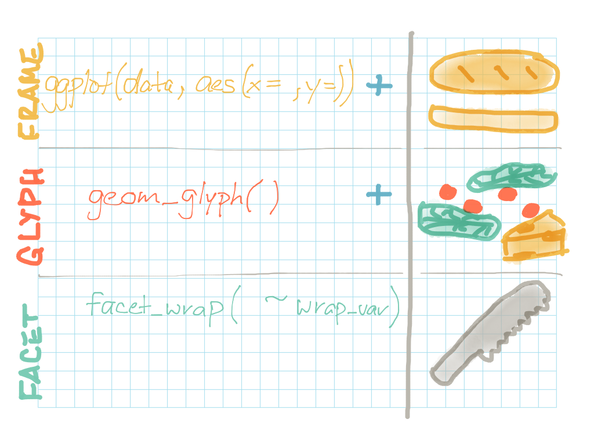

### Objectives {.objectives}

* Become familiar with the basic syntax for creating graphics using R's ggplot library

* Understand the basic structural components of ggplot graphics, including the **frame**, **glyphs**, and **facets** and how they fit together to make a complete graphic

* Practice using ggplot syntax to create graphics to illustrate specific features of a dataset

***

**Related to:** _Data Computing_, "Frames, Glyphs, and other Components of Graphics", Ch. 6; "Graphics and Their Grammar", Ch. 8

[<-- Back to Table of Contents](../index.html){.back-link}


## ggplot: R's graphical "sandwich artist"
Have you ever admired the "sandwich artists" who so skillfully put together your sandwich at Subway?  Have you ever wanted to learn how to create and serve up graphics that are a feast for the eyes and as tasty as your favorite sub sandwich?  Well, today's your lucky day!  Pull on your latex gloves and get ready to become a "sandwich"...erm... "graphics" artist!

At this point, you should know how to make a few different basic plots (ex: barplot, histogram, scatterplot).  And up until now, you've been making these basic plots using built-in "base R" functions and graphics settings.  This approach works just fine for exploratory analysis as you're first getting acquainted with your data.  But if you want to make more polished graphics to share as part of a report or publication, you're going to want up your graphics game a bit.  This is where the ggplot library comes in!

Putting together graphics using ggplot is a lot Like making a sub sandwich: you need to decide what kind of "bread" to have on the outside, what kinds of "toppings" you're going to have on the inside, and how you're going to "slice it up" before you serve it.  Do you need a graphic that's as simple and delicious as a single-serving ham and cheese sub?  Or do you need a graphic that's as loaded as a giant party sub, with lots of different topics and slices?  Either way, ggplot can help you out.  

To get started with ggplot, you'll need to make sure to install it the first time you use it:

```{r, eval=FALSE}
install.packages("ggplot2")
```

After ggplot is successfully installed, every time you want to use it, just make sure to load the library by running the following line of code at the beginning of your project.  Generally, you should only need to run this once at the beginning of each R project or session:

```{r, warning=FALSE, message=FALSE}
library(ggplot2)
```

And before we get started making some graphics, let's load up the Minneapolis buildings energy benchmarking dataset.  Make sure the .CSV file containing the data is in your R working directory, then load the dataset into your R environment:
```{r}
data <- read.csv("../datasets/mpls_energy_benchmarking_2015.csv", header=TRUE, na.strings=c("N/A", "Not Available", "NA", "0"))
```

#### Pro tip: Why "ggplot2"? {.pro-tip}
You may be wondering: _Why do I need to load "ggplot2" instead of just simply "ggplot"? What happened to ggplot number 1?_  ggplot is a relatively old library, so there _was_ an original version called [ggplot1](https://github.com/hadley/ggplot1).  Starting around 2008, however, the library was rewritten as "ggplot2".  The original ggplot is now out of date, and you will need to load ggplot2 to get the most current version.  To learn more about ggplot2, check out the [ggplot2.org](http://ggplot2.org/) website.


## The whole shebang
ggplot graphics always share the same general format, so do your best to try to memorize this general pattern as you work through the various examples in this tutorial.  You always need to start with a **frame** to hold it all together, then you can add **glyphs** like "toppings" to display your actual data using different visual styles and symbology, and finally you can slice up your graphic using **facets**.   You'll also need to string each of these components together using ggplot's pipe function, the plus symbol (`+`).  Here's a big picture look at how an entire ggplot graphic can be assembled, sandwich-style:



Now, let's take a look at each of these components separately...


## The Frame: The "bread" for your graphics

The **frame** acts a lot like the bread that will hold your graphical "sandwich" together.  The frame is simply the grid upon which you'll build the rest of your graphic.  When you're setting up the frame for a graphic, you need to call the `ggplot()` function and pass it two arguments: 1) the dataset you want to plot, and 2) a set of parameters called "aesthetics", wrapped in `aes()`.  

The "aesthetics" parameters can be a little confusing at first, so pay attention to how they are used throughout the examples that follow.  In general, the aesthetics will include a combination of the following information:

* **x** : the main / explanatory ("x") variable you want to plot (Note: If you are creating a graphic that uses only one variable, always list this variable as the "x" variable in the aesthetics)

* **y** : the response ("y") variable you want to plot

Some graphics only need a single "x" value in the aesthetic.  For example, here's the frame for a plot that looks at one variable--the site energy use intensity (EUI) ("site\_EUI") of the various buildings in our dataset:
```{r}
ggplot(data, aes(x=site_EUI))
```

Some graphics need both an "x" and a "y" value in the aesthetic.  For example, here's the frame for a plot comparing the year a building was built (explanatory variable) to its site EUI (response variable):
```{r}
ggplot(data, aes(x=year_built, y=site_EUI))
```

#### Pro tip: Customize your axis labels {.pro-tip}

ggplot will automatically try to label your graphic's X and Y axes based on your variable names.  But to create a cleaner, more readable plot, you can also easily add your own axis labels to your graphic's frame.  Use `xlab()` to set your graphic's X label, use `ylab()` to set your graphic's Y label, and use `ggtitle()` to set the main title of your graphic:  

```{r}
ggplot(data, aes(x=year_built, y=site_EUI)) +
  xlab("Year built") + 
  ylab("Site energy use intensity (EUI)") +
  ggtitle("Scatterplot of year built vs. site EUI for Mpls. buildings (2015)")
```

And sometimes, your X axis labels can get long and cumbersome, or simply look better with a little bit of rotation.  To rotate your X axis labels, simply add a `theme()` setting.  Inside of your `theme()`, set the `angle` of the x axis text (for example, we'll try 45 degrees).  Also set the text's horizontal justification (`hjust`) equal to 1, so your x axis labels bump up directly against the bottom of your plot:
```{r}
ggplot(data, aes(x=year_built, y=energy_star_score)) +
  xlab("Year built") + 
  ylab("Site energy use intensity (EUI)") +
  ggtitle("Scatterplot of year built vs. site EUI for Mpls. buildings (2015)") +
  theme(axis.text.x = element_text(angle = 45, hjust = 1))
```


## Glyphs: Your graphical "toppings"

And any decent graphical sandwich wouldn't be complete without toppings!  "Glyphs" are the graphical equivalent of sandwich toppings: they're the shapes, points, lines, curves, and other visuals you put inside of the frame you've just created.  If you take a quick look at table of contents within the [ggplot documentation](https://cran.r-project.org/web/packages/ggplot2/ggplot2.pdf), you can see that ggplot2 offers you a total of 28 different glyphs to choose from!  But don't worry--there are only a few common glyphs that you'll need to know for now, and you can save the rest for later exploration on your own.

But first, there are two main questions you need to answer about your data before working with glyphs.  The answer to these questions will limit your choice of glyphs, since not all glyphs work with all data types.  So, think about the type of graphic you want to create, and then ask yourself:

* Do I want to depict the shape/distribution of a _single_ variable only?  Or do I want to show the relationship between _two_ variables?

* Is my X variable _continuous_, or is my X variable _categorical_? 

**Continuous variables** are variables like numeric or integer variables that can take any possible value along a number line.  For example, in our buildings dataset, "year\_built", "site\_EUI" and "energy\_star\_score" are all continuous variables. **Categorical variables** are usually character or factor variables, where the variable can only take a values within a specific set of categories.  For example, in our buildings dataset, "prop\_type" and "organization" are categorical values because they can each only take values that fall within a specific set of categories: there are only 55 possible property type values, and 5 different organizations present in the dataset.

Some glyphs work with a single, continuous X variable. For example, you can use the `geom_histogram()` glyph type to examine the site energy use intensity ("site\_EUI") of the buildings in our dataset, which is a continuous numeric variable. Set up the frame using "site\_EUI" as the "x" aesthetic, then use the `geom_histogram()` glyph to add a histogram to the graphic:

```{r, warning=FALSE, message=FALSE}
ggplot(data, aes(x=site_EUI)) +
  geom_histogram()
```


Some glyphs require both an X and Y variable.  For example, you can use the `geom_point()` glyph to take the buildings' "year\_built" as an explanatory variable and compare it to the buildings' "site\_EUI" values as a response variable. Set up the frame using the "year\_built" as the "x" aesthetic, and "site\_EUI" as the "y"" aesthetic.  Then, use the `geom_point()` glyph to add points to the graphic to create a scatterplot:

```{r, warning=FALSE, message=FALSE}
ggplot(data, aes(x=year_built, y=site_EUI)) +
  geom_point()
```


Some glyphs, such as `geom_boxplot()` require a categorical variable for the "x" aesthetic, and a continuous variable for the "y" aesthetic:

```{r, warning=FALSE, message=FALSE}
ggplot(data, aes(x=org_name, y=site_EUI)) +
  geom_boxplot() +
  theme(axis.text.x = element_text(angle = 45, hjust = 1))
```


Here's a table that summarizes some of the most common glyphs used with ggplot.  It also indicates what aesthetic (`aes()`) variables each glyph requires when creating your graphic:

Glyph            | Aesthetic                   | Graphic
---------------- | --------------------------- | ---------------------------------------------------
geom_histogram() | x (continuous)                            | histogram
geom_density     | x (continuous)                            | density plot (similar to a histogram, but with a curved line instead of a series of bars indicating where data is most densely distributed)
geom_bar()       | x (categorical)                           | barchart
geom_point()     | x (continuous) & y (continuous)           | scatterplot
geom_boxplot()   | x (categorical) & y (continuous)          | grouped boxplot
geom_violin()    | x (categorical) & y (continuous)          | grouped violin plot (a combination of a boxplot and a density plot)


#### Pro tip: Customize your axis limits and scales {.pro-tip}

Sometimes when you're examining various variables in your dataset, you'll notice that there seem to be a handful of extreme values (aka "outliers").  For example, have a look at the following scatterplot that shows the relationship between a building's floor area and its total greenhouse gas emissions: 

```{r, echo=FALSE, warning=FALSE, message=FALSE}
ggplot(data, aes(x=floor_area, y=total_GHG_emissions, col=ifelse(floor_area > 2000000 | total_GHG_emissions > 20000, TRUE, FALSE))) +
  geom_point() +
  scale_colour_manual(name="", values = setNames(c('red','black'), c(TRUE, FALSE))) +
  theme(legend.position = "none")
```

In the plot above, there are a handful of observations, marked in red, that represent outliers.  These are buildings that either have _very_ large floor areas, _very_ high greenhouse gas emissions, or both.  These values are interesting, and are worth looking into more in a separate analysis.  But for now, they seem to be skewing the plot so that a large number of observations are crowded into the lower left-hand corner of the plot.  With the majority of the observations crowded together like this, it makes it harder to see what trend is going on across the majority of the buildings in the dataset.

In a situation like this, then, it makes sense to remove the outliers so that you can focus your graphic a little better.  One simple way to remove outliers when creating a graphic is to set **axis limits** for your graphic.  This will plot _only_ the values that fall within your axis limits, and will remove all outliers that fall outside of these limits.  You can use `scale_x_continuous(limits=c(lower, upper))` and `scale_y_continuous(limits=c(lower, upper))` to set axis limits for your X and Y axis, respectively.  For example, let's limit the X axis of the graphic to include only buildings whose floor area falls between 0 and 2,000,000 square feet.  And let's limit the Y axis of the graphic to include only buildings whose greenhouse gas emissions fall between 0 and 15,000 million metric tons:

```{r, warning=FALSE, message=FALSE}
ggplot(data, aes(x=floor_area, y=total_GHG_emissions)) +
  geom_point() +
  scale_x_continuous(limits=c(0, 2000000)) +
  scale_y_continuous(limits=c(0, 15000))
```

The result is a new graphic that is "zoomed in" on the lower left-hand corner of data.  This helps you ignore the outliers, and focus better on the pattern present in the rest of the observations in the dataset.


### Activity A: Practice your graphical art! {.activity}

Make at least three graphics featuring your choice of variables from the Minneapolis buildings energy benchmarking dataset.  Make sure each of your graphics uses a different glyph type.  Change the axis labels and title for each graphic so that it can be easily understood by someone who is unfamiliar with the data.

For each plot, also write a 1-2 sentence description interpreting the graphic.  What is the graphic demonstrating about the variables you looked at?


## Facets: Slice up your graphics

The final step to making a graphical "sandwich" is slicing up your graphic using **facets**.  Note that this step is **optional**--you don't _have_ to use facets when creating a graphic, just like you don't have to cut up a subway sandwich before eating it!

But facets can help you separate your graphic based on specific variables of interest.  For example, let's say you're interested in whether the total greenhouse gas emissions ("total\_GHG\_emissions") varies based on whether a building is public or privately-owned.  You can use `facet_wrap()` to easily chop up your graphic into two side-by-side plots--one for public and one for private buildings.  Inside of the `facet_wrap()` function, simply add a tilde ("~"), along with the variable you want to use to separate the rows of your data into separate parts of the graphic:

```{r, warning=FALSE, message=FALSE}
ggplot(data, aes(x=total_GHG_emissions)) +
  geom_histogram() +
  facet_wrap( ~ public_private)
```


### Activity B: Putting together graphics using frames, glyphs, and facets {.activity}

#### Exercise 1

Make a graphic with the following features:

* Frame aesthetic variable: "prop\_type"

* Glyph: `geom_bar()`

* Facet: "public\_private"

Note: If you're having trouble reading the labels, you may also want to adjust the angle of the X axis label text.  Remember, you can add the following argument to your ggplot to rotate the X axis label text: `theme(axis.text.x = element_text(angle = 45, hjust = 1))`

Now, answer the following questions:

1. Of all of the office buildings in the dataset, do more appear to be publicly or privately-owned?

2. Of all of the K-12 schools in the dataset, do more appear to be publicly or privately-owned?

3. How many publicly-owned parking lots do there appear to be in the dataset?  How many privately-owned parking lots?


#### Exercise 2

Make a graphic with the following features:

* Frame aesthetic variable: "site\_EUI"

* Glyph: `geom_histogram()`

* Facet: "prop\_type"

Note: If you want to make sure your plot doesn't get too wide, you can specifiy the number of rows (ex: `nrow=5`) or number of columns (ex: `ncol=5`) as an additional argument within the `facet_wrap()` portion of your graphic.  For this example, try adding `ncol=5` and see if that makes your graphic more readable.

Now, answer the following questions:

1. Compare the property type "Parking" with the property type "Office".  Which of these two property types appears to have lower site energy use intensity, in general?  (For example, if we picked a random parking lot and a random office building from the dataset, which of them would likely have the lower site energy use intensity?)

2. Which property type appears to have to broadest range in site energy use intensity?  (Remember that "range" is the difference between the maximum and the minimum values in a group of values.)

3. Let's say you are part of a company reponsible for building a new worship facility in the city of Minneapolis. You have a lot of different options about the kinds of materials to use in construction, some of which are more energy efficient than others.   Your main goal is to make sure your building's site energy use intensity (EUI) ("site\_EUI") is similar to other worship facilities within the city.  When making decisions about which materials to use in the construction, what site EUI range should you aim for so that your building falls within the standard range for worship facilities?
