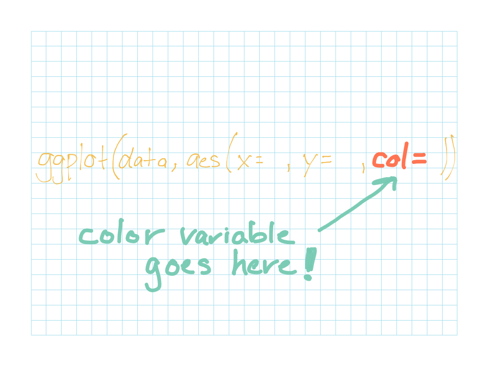
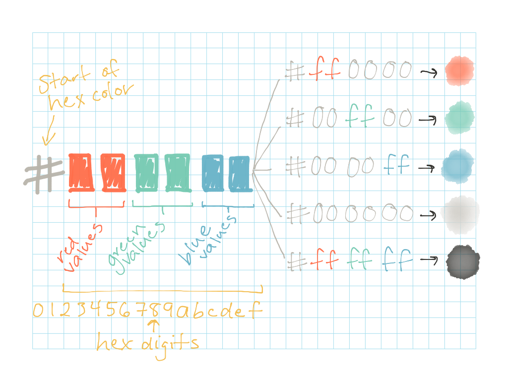

### Objectives {.objectives}

* Learn how to add color to graphics using ggplot syntax

* Understand the difference between **categorical** and **continuous** variables, and how to handle each of them differently when choosing a color scheme for your graphic 

* Experiment with using both `col=` and `fill=` to add color using ggplot, and understand how they alter the resulting graphic


## Use color to add additional variables or emphasis to graphics

Sometimes you want to add a little splash of color to your graphic--kind of like adding a little bit of "special sauce" to a subway sandwich.  Colors are useful if you want to add additional emphasis to one of the relationships in your graphic, or add an additional variable to the relationships already being displayed in your graphic.

Before we get started making colorful graphics, let's again load both the ggplot library and the Minneapolis buildings energy benchmarking dataset:
```{r}
library(ggplot2)

data <- read.csv("../datasets/mpls_energy_benchmarking_2015.csv", header=TRUE, na.strings=c("N/A", "Not Available", "NA", "0"))
```

Generally, you can add color to your plot by simply adding a `col=variable_name` or `fill=variable_name` argument to your aesthetics when you're setting up the plot:




#### Pro tip: `col=` or `fill=`? {.pro-tip}

There are two different aesthetics that affect your graphic's color: `col` and `fill`.  Each of them has a slightly different effect, and it may take a bit of trial and error before you learn which one is most appropriate for which glyphs.

In general, `col` is what you should use if want to add colors to the points on a scatterplot, or add colors to the outline of your glyphs.  And `fill` is what you should use if you want to _fill in_ colors on a boxplot, violin plot, or other plot that has fillable geometric shapes.  Here's a quick table that summarizes when you should use `col` and when you should use `fill`:

Plot type    | `col` effect                            | `fill` effect
------------ | --------------------------------------- | ----------------------------------------
boxplot      | adds color to **outline** of each boxplot | adds color to **inside** of each boxplot
histogram    | adds color to the **outline** of each bar in histogram | adds color to **inside** of each bar in histogram
barchart     | adds color to **outline** of each bar   | adds color to the **inside** of each bar
scatterplot  | colors the points in the scatterplot    | N/A 

Sometimes it's hard to remember if your glyph requires you to ues `col=` or `fill=` inside of your ggplot aesthetics.  If aren't sure which one to use, you can always simply try both and see which one works best!


## Colors for categorical variables

Colors can be used to illustrate categorical variables.  For example, for our Minneapolis buildings energy benchmarking dataset, you can make a scatterplot comparing the "year\_built" vs. the building's "site\EUI".  You can then add an additional dimension to the plot that shows points color-coded based on which organization the building belongs to:
```{r, message=FALSE, warning=FALSE}
ggplot(data, aes(x=year_built, y=site_EUI, col=org_name)) +
  geom_point()
```

If you don't like ggplot's default colors, you can also define your own **custom colors** to use in your graphic.  Simply add `scale_colour_manual(values = c())` to your plot to choose custom colors to use with a categorical variable.  Just make sure you have the same number of color values as you do categories within your variable.  For example, the "organization" variable has 5 different categories within it, so we can manually assign each of these categories a distinct color as follows:

```{r, message=FALSE, warning=FALSE}
ggplot(data, aes(x=year_built, y=site_EUI, col=org_name)) +
  geom_point() +
  scale_colour_manual(values = c("red", "orange", "yellow", "green", "blue"))
```

#### Pro tip: R's color options {.pro-tip}

R has a built-in color palette of 657 unique colors you can use when creating your graphics.  Run the following command to print the names of all of R's built-in colors to the console:
```{r, eval=FALSE}
colors()
```

You can use any of these colors when choosing custom colors for your color scales.  Just make sure to surround them in quotes (""), and you can add any of these colors to the `values=c()` argument as shown in the manual color scale above.

R will also recognize **hex colors**.  Hex colors are a way of combining numbers together to define a broad palette of colors.  They are called "hex" colors, because the numbers used to define them are **hexadecimal** numbers.  The hexadecimal counting system starts similarly to the decimal (base 10) system, but adds a few additional "numbers" to create a base _16_ system.  For example, here's how to count from 0 to 15 in hexadecimal: `0, 1, 2, 3, 4, 5, 6, 7, 8, 9, a, b, c, d, e, f`

Hex colors, then, are colors that combine hexadecimal numbers together to create specific colors:



Hex colors are commonly used for web design and digital graphic design.  You can use online tools like [Color Hex](http://www.color-hex.com/) and or [HTML Color Codes](http://htmlcolorcodes.com/) to pick out palettes of hex colors.  To learn more about hex colors and the theory behind them, check out [this article from Smashing Magazine](https://www.smashingmagazine.com/2012/10/the-code-side-of-color/).  


## Colors for continuous variables

Colors can also be used to illustrate continuous variables.  For example, we can add an additional dimension to the plot of "year\_built" vs. "site\_EUI" that color-codes the points based on the buildings' greenhouse gas emissions ("total\_GHG\_emissions") :

```{r, message=FALSE, warning=FALSE}
ggplot(data, aes(x=year_built, y=site_EUI, col=total_GHG_emissions)) +
  geom_point()
```

The plot above shows which buildings in the dataset have high greenhouse gas emissions levels.  Buildings with high greenhouse gas emissions are colored light blue, and buildings with low emissions are colored dark blue.  At first glance, this default color scheme may be a little confusing, though!  Intuitively, we might expect that _dark_ blue should signal high emissions, and _light_ blue should signal low emissions.  That way, the more saturated color represents a higher saturation of greenhouse gas emissions, and vice-versa.  To invert the color scheme, you simply need to add a `scale_colour_continuous()` option as follows:

```{r, message=FALSE, warning=FALSE}
ggplot(data, aes(x=year_built, y=site_EUI, col=total_GHG_emissions)) +
  geom_point() +  
  scale_colour_continuous(trans = 'reverse')
```

And again, if you don't like ggplot's default colors, you can also define your own **custom colors** to use for categorical variables.  This time, instead of selecting a set of multiple colors, you only need to select two colors: one that you want to represent the _lower_ values of your variable, and another that you want to represent the _higher_ values of your variable.  This will define the **color gradient** used in your plot.  Your data, when plotted, will fade from the low end of the color scale you've selected to the high end.  

Let's see it in action!  We'll mark buildings where the greenhouse gas emissions are _low_ in green (hex code: `#00ff00`) and we'll mark buildings with high greenhouse gas emissions in red (hex code: `#ff0000`).  Now when we plot the data, you should see that there are a handful of buildings in the dataset that have markedly high greenhouse gas emissions (orange & red points), and there are a small number of buildings that have missing values for their greenhouse gas emissions (grey points).
```{r, message=FALSE, warning=FALSE}
ggplot(data, aes(x=year_built, y=site_EUI, col=total_GHG_emissions)) +
  geom_point() +
  scale_colour_continuous(low = "#00ff00", high ="#ff0000")
```


### Activity A: Use color to juggle three variables in the same plot! {.activity}

You want to explore the relationship between the year a building was built and its water use.  You suspect that buildings that were built more recently may use less water than buildings that were built a long time ago.  You also know, however, that a building's floor area can greatly affect the amount of water it uses.  You want to fit these three variables onto a plot to examine the relationship between them.  Make a plot incorporating the following aesthetics:

* X variable: year_built

* Y variable: water_use

* Color variable: floor_area

* Continuous color scale: Low value = yellow (#ffff00); High value = blue (#0000ff)

In 3-5 sentences, summarize what you see in the plot.  Does a building's "year\_built" seem to be strongly related to its "water\_use"?  (i.e. Do buildings built more recently seem to have consistently lower "water\_use" values?)  Does a building's "floor\_area" seem to be related it its water use?  (i.e. Do buildings with higher "water\_use" values also have greater "floor\_area" values?)


## Fill with colors

If you're using colors on a boxplot, violin plot, or other plot that has shapes that need to be filled, use the `fill=` argument, rather than the `col=` argument.  (Note: Sometimes it's hard to remember if your glyph requires you to ues `col=` or `fill=` inside of your ggplot aesthetics.  If aren't sure which one to use, simply try both and see which one works best!)

```{r, message=FALSE, warning=FALSE}
ggplot(data, aes(x=org_name, y=site_EUI, fill=org_name)) +
  geom_boxplot() +
  theme(axis.text.x = element_text(angle = 45, hjust = 1))
```

And again, if you prefer to set the colors manually rather than using ggplot's default colors, that's easy to do!  Simply use the `scale_fill_manual(values = c())` to define custom colors for categorical variables in filled plots.  Just make sure you select a color for each category present in the variable:

```{r, message=FALSE, warning=FALSE}
ggplot(data, aes(x=org_name, y=site_EUI, fill=org_name)) +
  geom_boxplot() +
  scale_fill_manual(values = c("red", "orange", "yellow", "green", "blue")) +
  theme(axis.text.x = element_text(angle = 45, hjust = 1))
```


### Resources and references

* Color Hex. (2016). Retrieved from: http://www.color-hex.com/

* HTML Color Codes. (2016). Retrieved from: http://htmlcolorcodes.com/

* Gremillion, B. (2012). "The code side of color". _Smashing Magazine_. Retrieved from: https://www.smashingmagazine.com/2012/10/the-code-side-of-color/ 
