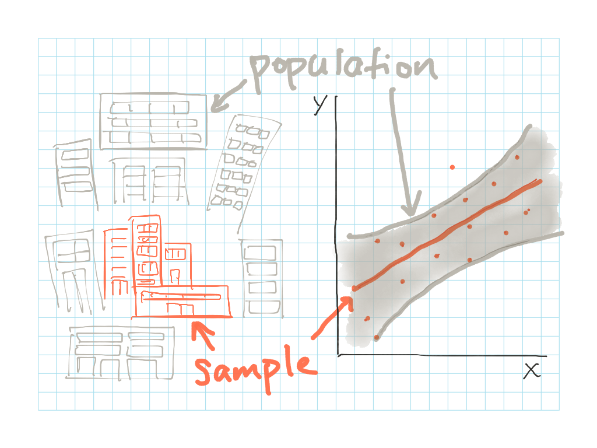
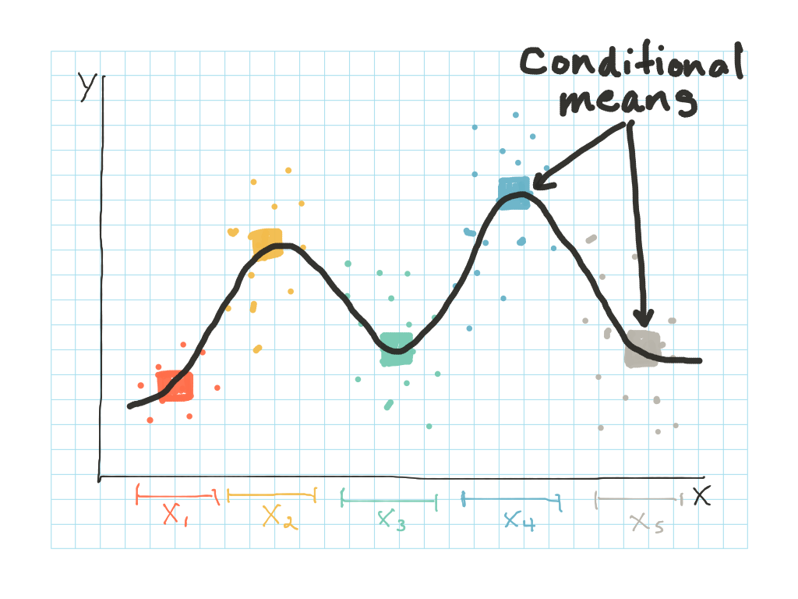

### Objectives {.objectives}

* Learn how to add a basic linear regression line to a ggplot graphic and interpret the result

* Learn how to add more complex lines to ggplot graphics, including: 1) linear regression lines separated by observation groups, and 2) smoothed curve lines 

***

**Related to:** _Data Computing_, "Collective Properties of Cases", Ch. 14

[<-- Back to Table of Contents](../index.html){.back-link}


## Linear regression lines

ggplot makes it easy to add linear regression lines to a plot.  A **linear regression line** is a very simple way to visualize the **direction** and **magnitude** of a relationship between two variables.  It helps you say things like: "If variable X goes up by one unit, then variable Y tends to also go up by Z number of units" or "If variable X goes up by one unit, then variable Y tends to go down by Z number of units".  

It is important to note that sometimes this type of linear relationship can be a bit _too_ simple to effectively sum up more complex relationships between variables.  To address this concern, we'll look at an alternative approach in a minute.  But for now, let's look at how to add a simple linear regression line to a ggplot graphic.

Before we get started, let's again load both the dplyr and ggplot libraries, as well as the Minneapolis buildings energy benchmarking dataset:
```{r, warning=FALSE, message=FALSE}
library(dplyr)
library(ggplot2)

data <- read.csv("../datasets/mpls_energy_benchmarking_2015.csv", header=TRUE)
```

To add a linear regression line to your graphic, simply add the `stat_smooth()` glyph to the code for your plot, and then pass it the argument `method='lm'`.  'lm' stands for "linear model", which tells ggplot to generate a **linear regression line** representing the relationship between the X and Y variables in your aesthetics arguments and then add this line to your graphic:

```{r}
ggplot(data, aes(x=year_built, y=site_EUI)) +
  geom_point() +
  geom_smooth(method='lm')
```

You can now see that ggplot has added a line indicating a very flat-looking relationship between the year built and site energy use intensity (EUI) for the buildings in our dataset.  From the plot above, it looks like most of the buildings have a site EUI that falls between 0 to about 300 kBtu/sq. ft.  There are a few outliers, however, that have a site EUI over 300 kBtu/sq. ft.  Let's see which buildings these are:

```{r}
data %>% filter(site_EUI > 300)
```

Let's now change something: let's restrict the limits of the Y axis so it ranges from 0 to 300 kBtu/sq. ft.  This will eliminate the handful of outliers that have very high site EUI values.  We will want to make a note about these outliers elsewhere in the analysis, but restricting the Y axis limits for now will allow you to "zoom in" and see more details of the relationship between the buildings' year built and their site EUI values:

```{r, message=FALSE, warning=FALSE}
ggplot(data, aes(x=year_built, y=site_EUI)) +
  geom_point() +
  ylim(0, 300) +
  stat_smooth(method='lm')
```

The plot above is "zoomed in" a bit, making it a little easier to see the regression line.  You can now see that the line is quite flat and the points seem to scatter pretty randomly above and below the regression line.  This indicates that there doesn't seem to be a consistent relationship between the year a building was built and its site EUI.  Our buildings' `year_built`, then, _does not_ help explain much--if any--of the variation across the buildings' `site_EUI` values. 


### Activity A: Make a new linear regression line {.activity}

Now you are interested in whether the floor area of a building is related to its level of greenhouse gas emisssions.  You suspect that buildings larger floor areas have higher greenhouse gas emissions than buildings with smaller floor areas.  Create a plot with the following aesthetics and components:

* X variable: floor_area

* Y variable: total\_GHG\_emissions

* Regression: single linear regression line relating the X & Y variables

Does the plot offer any evidence to support your hypothesis that buildings with larger floor areas tend to have higher levels of greenhouse gas emissions?


## Grouped linear regression lines

Now, let's add a color (`col=`) argument to the aesthetic.  This will group the data, generate a separate regression line for each group, and then color the points and regression lines based on these groups.  For example, we can try using the `public_private` variable as our color grouping variable.  This will let us discern if there's a difference in the relationship for public vs. private buildings when comparing the buildings' year built with their site EUI values:

```{r, message=FALSE, warning=FALSE}
ggplot(data, aes(x=year_built, y=site_EUI, col=public_private)) +
  geom_point() +
  ylim(0, 300) +
  stat_smooth(method='lm')
```

This results in two separate regression lines--one showing the relationship between the year built and site energy use intensity for _private_ buildings, and one for _public_ buildings.  You can see that the lines actually look quite different, and you should be able to notice a few key details:

The regression line for private buildings has a **positive slope**, indicating that private buildings' site EUI actually seems to be going up in newer buildings.  That means that, the more recently a private building was built, the higher we expect its energy use intensity to be.  The slope of the line is not very steep, so this trend may not be hugely concerning to policymakers interested in energy efficiency--but nonetheless there _does_ appear to be an upward trend in the site EUI for private buildings.  

The regression line for public buildings, on the other hand, has a **negative slope**, indicating that public buildings' site EUI seems to be going down in newer buildings.  This could be due to any number of factors.  For example, perhaps regulations have been put in place to lower the energy use intensity in more recently-constructed public buildings, or maybe the city has offered new financial incentives to public organizations that build efficient buildings, or perhaps we're simply seeing a recent architectural trend where energy-efficient public buildings are becoming "the norm".  In an analysis, we would want to do additional research to generate a few informed theories that could help explain the "Why?" behind this relationship.

You'll also notice that the regression line for public buildings doesn't start until about the year 1900.  This is because the dataset does not contain any public buildings built before this time period.  By default, ggplot will only draw a regression line for areas of the dataset where there is sufficient data to represent a trend.


## Confidence intervals

The grey shaded areas around each regression line in the plots above are the **confidence intervals** (also sometimes called "confidence bands") for the regression lines.  They represent the uncertainty present in the each regression due to sampling error.

For example, let's think about the confidence interval surrounding the regression line for private buildings.  The private buildings represented in this dataset are only one particular **sample** of all of the private buildings in the Twin Cities metropolitan area.  This dataset contains a certain subset of Minneapolis private buildings, but there are other private buildings--in St. Paul, Bloomington, Brooklyn Park, Maple Grove, Hopkins, etc.--that are _not_ represented in this dataset.  These buildings all represent the **population** of public buildings in the Twin Cities metropolitan area.  The buildings in this dataset, then, represent merely a sample of a much broader population.



If we want to be able to say something more general about the broader **population** of private buildings, we need to be a little cautious.  We cannot simply look at the private buildings' regression line in the plot above and assume that it represents the "true" trend for _all_ private buildings in the population.  Instead, we need to examine the confidence interval surrounding the regression line to form an "educated guess" about the true relationship between `year_built` and `site_EUI` that we can generalize to _all_ private buildings in the population.  

Based on the confidence interval, we can say that:

> There is a 95% probability that the "true" regression line representing the relationship between `year_built` and `site_EUI` for the entire population of private buildings lies somewhere within the grey shaded area of the confidence interval.

The true relationship may lie slightly higher or lower, or have a slightly different slope than the line depicted in the plot above, but there is a high probability that the line lies _somewhere_ within the confidence interval.


### Activity B: Make a new grouped linear regression line {.activity}

Now you are interested in returning to the question of how the floor area of a building is related to its level of greenhouse gas emissions.  More specifically, you are wondering whether the relationship between "floor\_area" and "total\_GHG\_emissions" is different for public vs. private buildings.  You suspect there may be certain regulations about greenhouse gas emissions that affect public and private buildings differently, resulting in one of the groups of buildings having lower overall greenhouse gas emissions, even after controlling for floor area.  Create a plot with the following aesthetics and components:

* X variable: floor_area

* Y variable: total\_GHG\_emissions

* Color/grouping variable: public\_private

* Regression: linear regression lines relating the X & Y variables, and split into separate lines based on the grouping variable

Does the plot offer any evidence to support your hypothesis that the two types of buildings--public vs. private--differ when it comes to their relationship between floor area and greenhouse gas emissions?  Be sure to pay attention to the grey shaded confidence interval when interpreting the relationship between the two regression lines.  If the confidence intervals of the two linear regression lines are fully separate from each other, with no overlap, then the two groups exhibit different relationships between the variables being examined.  If the confidence intervals overlap, then there is not enough evidence to conclude that the to "true" difference between the groups is significantly different.


## Think outside the...line

Up until now, we've focused on one particular type of regression line--a _linear_ regression--that can help describe how two variables are related.   But rarely are variables related in a strictly linear way, and it may not always be appropriate to impose or imply a straight line relationship between two variables.  

Instead, you may prefer to use a more general technique for examining the relationship between two variables: a smoothed curve.  The ggplot library makes it easy to add smoothed curves to your plots.  To generate a smoothed curve, R simply finds the mean of the Y values at or around each value of X, marks this mean as a point on the curve, then moves on to find the mean of the Y values associated with the next value of X.  These mean values are called **conditional means**, since they are "conditional" on each given value of X.  The result is kind of like stringing together beads (aka "means") along a string:



Getting back to our dataset, let's look at the plot comparing "year\_built" and "site\_EUI" again, but this time we'll remove the `method='lm'` argument.  By default, then, `stat_smooth()` will add curved lines to fit the data:

```{r, message=FALSE, warning=FALSE}
ggplot(data, aes(x=year_built, y=site_EUI, col=public_private)) +
  geom_point() +
  ylim(0, 300) +
  stat_smooth()
```

These curved lines are a little trickier to interpret than then linear regression lines above.  It is harder to discern a difference between public and private buildings, since the confidence intervals for their curves overlap each quite a bit.  In places where the confidence intervals for public and private buildings' curves overlap, we cannot conclude with confidence that there is a difference in site EUIs between the two groups.  In places where the confidence intervals _do not_ overlap, we can reasonably conclude that there is a significant difference in the site EUIs between private vs. public buildings.  So if we're interpreting the plot above, we can say something like: 

> "For buildings built between the years 1900 to about 1990, we cannot conclude that there is any significant difference in the site energy use intensity between public and private buildings.  For buildings built after 1990, however, the data suggest that public buildings have started to exhibit a significantly lower site energy use intensity compared to private buildings built in the same time period."


## Resources and references

* "Add a smoothed conditional mean". (2016). _ggplot2, 2.1.0_ [documentation]. Retrieved from: http://docs.ggplot2.org/current/geom_smooth.html

* "R FAQ: How can I explore different smooths in ggplot2?". (2012). _UCLA Institute for Digital Research and Education_. Retrieved from: http://www.ats.ucla.edu/STAT/r/faq/smooths.htm

