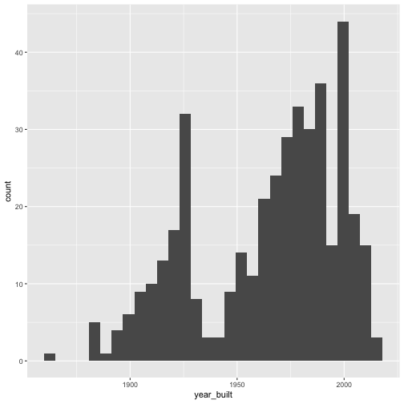

<style>
.activity{
  background-color: #EEF2B8;
  padding: 10px;
  margin-bottom: 10px;
}

.pro-tip{
  background-color: #D0EDF5;
  padding: 10px;
  margin-bottom: 10px;
}
</style>

Intro to R & Data Visualization
========================================================
author: Alison Link
date: 30 November 2017
width: 1440
height: 900


Tutorials
========================================================

https://linkalis.github.io/r-data-viz-basics-tutorials/


Keep your projects organized together in separate folders–this helps R find them.
========================================================


The data stays behind the scenes, while you slice and dice it on the surface.
========================================================

This head() function shows the first few rows of your data


```r
data <- read.csv("mpls_energy_benchmarking_2015.csv")

head(data)
```

```
         org_name                  prop_name public_private
1 Hennepin County               1800 Chicago         Public
2 Hennepin County            Central Library         Public
3 Hennepin County              Century Plaza         Public
4 Hennepin County      Family Justice Center         Public
5 Hennepin County Forensic Sciences Building         Public
6 Hennepin County          Government Center         Public
                   address zip_code energy_star_score      prop_type
1          1800 Chicago S.    55404                88         Office
2         300 Nicolet Mall    55401                 0          Other
3        330 south 12th st    55404                98         Office
4           110 S. 4th St.    55415                97     Courthouse
5 530 Chicago Avenue South    55415                 3 Medical Office
6             300 S. Sixth    55487                83     Courthouse
  floor_area floor_area_parking year_built total_GHG_emissions site_EUI
1     102815                  0       1996                 847       74
2     406354             266266       2004                2971       48
3     297650             194471       1934                2375       56
4     227422              49804       1956                1516       53
5      62602                  0       1974                1219      218
6    1182041             168895       1974               11815       88
  weather_normalized_site_EUI source_EUI weather_normalized_source_EUI
1                          79        137                           141
2                          50        115                           118
3                          58        127                           130
4                          56        109                           111
5                         224        331                           339
6                          91        164                           168
  water_use
1      2574
2      7203
3      2876
4      1087
5       401
6     10135
```

========================================================

The names() function shows you all of the variable names (column titles) that are present in your data


```r
names(data)
```

```
 [1] "org_name"                      "prop_name"                    
 [3] "public_private"                "address"                      
 [5] "zip_code"                      "energy_star_score"            
 [7] "prop_type"                     "floor_area"                   
 [9] "floor_area_parking"            "year_built"                   
[11] "total_GHG_emissions"           "site_EUI"                     
[13] "weather_normalized_site_EUI"   "source_EUI"                   
[15] "weather_normalized_source_EUI" "water_use"                    
```

========================================================

The str() function shows you additional information about a specific variable in your data


```r
str(data$year_built)
```

```
 int [1:415] 1996 2004 1934 1956 1974 1974 1989 1976 1983 1995 ...
```


There are always multiple ways to do things–there’s never a single right answer!
========================================================


Know the ways to ask for help
========================================================

- Ask for help() in RStudio

- Learn how to Google for R help
    - Stack Overflow: (http://stackoverflow.com/questions/tagged/r)
    - R bloggers: (http://www.r-bloggers.com/)
    - Quick-R: (http://www.statmethods.net/)


Expect error messages. They are your friends. Use the information they give you!
========================================================

<span class="activity">Activity: Google your errors</span>

Here’s an R expression that yields an error message. Copy and paste each line of this code into the console in RStudio, then hit “Enter” to run the code. See if you can yield an error message:


```r
x <- c("A", "B", "C", "D", "E")
mean(x)
```

Why do you think this is throwing an error?


A "first date" with your data in R/RStudio
========================================================

1) Download the data from: https://linkalis.github.io/r-data-viz-basics-tutorials/

2) Read in the data:


```r
data <- read.csv("mpls_energy_benchmarking_2015.csv", header=TRUE, na.strings=c("N/A", "Not Available", "NA", "0"))
```

<span class="activity">Activity: Get to know your data</span>

Pick a variable in the dataset and run the `summary()` command on it. What do you see? 

Pick a variable in the dataset and run the `str()` command on it. What data type does it appear to be?  Note that R sometimes guesses wrong about the type of data it thinks is contained in a variable/column. For the variable you selected, does it seem like R guessed correctly, or did it pick a data type that seems wrong based on your understanding of what the variable is supposed to be measuring?


Have your cake, or eat it? 
========================================================

Calling a function command ...

```r
table(data$prop_type)
```

...vs. assigning the result of a function to a variable.


```r
building_types <- table(data$prop_type)
```

Making a new column:

```r
data$years_ago <- 2016 - data$year_built
```


Data frames
========================================================


Vectors
========================================================


Data types: The “flavors” of data
========================================================

R data type     | What type of data does it contain? | Example
--------------- | ---------------------------------- | -----------------------------------
**Character ("chr")** | letters and other text characters (aka "strings" in programming speak) | players' first and last names
**Numeric ("num")**   | numbers, including negative numbers and numbers with decimal points    | weight, height
**Integer ("int")**   | similar to numeric, but for whole numbers, including negative whole numbers | age, social security number
**Logical ("logi")**  | information on true/false questions                                     | "this person has participated before", "this person is a vegetarian"
**Factor**            | unordered _or_ ordered categorical information                          | team they're on (unordered categorical variable); T-shirt size (S, M, L, XL) (ordered categorical variable)


========================================================


```r
# Character vector
player_name <- c("Abdi", "Brit", "Chloe", "Dani", "Ed")

# Numeric vector
player_weight <- c(150.5, 220.8, 135.2, 125.1, 180.2)

# Integer vector
player_age <- c(18, 20, 24, 19, 22)

# Logical vector
vegetarian <- c(TRUE, FALSE, FALSE, TRUE, FALSE)

# Factor vector
tshirt_size <- factor(c("L", "XL", "S", "S", "M"), levels=c("S", "M", "L", "XL"))

# Combine into a data frame
baseball_tournament_df <- data.frame(player_name, player_weight, player_age, vegetarian, tshirt_size)
```

Converting between data types
========================================================


```r
as.character(data$variable)
as.numeric(data$variable)
as.integer(data$variable)
as.logical(data$variable)
as.factor(data$variable, levels=c(...))
```

Factors are special
========================================================

<span class="activity">Activity: Exploring factor variables</span>

Run the following data type conversions on the tshirt_size vector. What do you see? Why do you think you’re getting different results for as.numeric() and as.character() conversion? What is going on here?


```r
tshirt_size <- factor(c("L", "XL", "S", "S", "M"), levels=c("S", "M", "L", "XL"))

as.numeric(tshirt_size)
as.character(tshirt_size)
```


ggplot: R’s graphical “sandwich artist”
========================================================


========================================================


```r
install.packages("ggplot2")

library(ggplot2)
```


The Frame: The “bread” for your graphics
========================================================


```r
ggplot(data, aes(x=site_EUI))
```


========================================================


```r
ggplot(data, aes(x=year_built, y=site_EUI))
```


========================================================


```r
ggplot(data, aes(x=year_built, y=energy_star_score)) +
  xlab("Year built") + 
  ylab("Site energy use intensity (EUI)") +
  ggtitle("Scatterplot of year built vs. site EUI for Mpls. buildings (2015)") +
  theme(axis.text.x = element_text(angle = 45, hjust = 1))
```


Glyphs: Your graphical “toppings”
========================================================


```r
ggplot(data, aes(x=site_EUI)) +
  geom_histogram()
```


========================================================


```r
ggplot(data, aes(x=year_built, y=site_EUI)) +
  geom_point()
```


========================================================


```r
ggplot(data, aes(x=org_name, y=site_EUI)) +
  geom_boxplot() +
  theme(axis.text.x = element_text(angle = 45, hjust = 1))
```


Know your glyphs!
========================================================

Glyph            | Aesthetic                   | Graphic
---------------- | --------------------------- | ----------------------------------
geom_histogram() | x (continuous)              | histogram
geom_density     | x (continuous)              | density plot (similar to a histogram, but with a curved line instead of a series of bars indicating where data is most densely distributed)
geom_bar()       | x (categorical)             | barchart
geom_point()     | x (continuous) & y (continuous)           | scatterplot
geom_boxplot()   | x (categorical) & y (continuous)          | grouped boxplot
geom_violin()    | x (categorical) & y (continuous)          | grouped violin plot (a combination of a boxplot and a density plot)


Facets: Slice up your graphics
========================================================


```r
ggplot(data, aes(x=total_GHG_emissions)) +
  geom_histogram() +
  facet_wrap( ~ public_private)
```


Your turn
========================================================

<span class="activity">Activity: Pick your plot</span>

For each of the questions below, pick a plot type from the ones discussed above (boxplot, histogram, barchart, scatterplot) that you think could best address the question. Then, try to create a plot that you think helps address each question:

- How many of each type of building (“prop_type”) are present in the dataset?

- In approximately what year was the oldest building in the dataset built? The newest building?

- Is there a relationship between the amount of floor area in a building (“floor_area”) and its greenhouse gas emissions (“total_GHG_emissions”)?

- When it comes to site energy use intensity (“site_EUI”), does the dataset tend to have buildings that fall towards the extremes of the spectrum (i.e. many buildings with extremely high or extremely low site energy use intensity measures)? Or do most buildings in the dataset fall somewhere in the middle?

- Are there certain property types ("prop_type") that seem to have consistently higher energy use intensities ("site_EUI") than others?


========================================================

How many of each type of building ("prop_type") are present in the dataset

```r
ggplot(data, aes(x=prop_type)) +
  geom_bar() +
  theme(axis.text.x = element_text(angle = 45, hjust = 1))
```


========================================================

In approximately what year ("year_built") was the oldest building in the dataset built? The newest building?

```r
ggplot(data, aes(x=year_built)) +
  geom_histogram()
```




========================================================

Is there a relationship between the amount of floor area in a building (“floor_area”) and its greenhouse gas emissions (“total_GHG_emissions”)?

```r
ggplot(data, aes(x=floor_area, y=total_GHG_emissions)) +
  geom_point()
```


========================================================

When it comes to site energy use intensity (“site_EUI”), does the dataset tend to have buildings that fall towards the extremes of the spectrum (i.e. many buildings with extremely high or extremely low site energy use intensity measures)? Or do most buildings in the dataset fall somewhere in the middle?


```r
ggplot(data, aes(x=site_EUI)) +
  geom_histogram()
```


========================================================

Are there certain property types ("prop_type") that seem to have consistently higher energy use intensities ("site_EUI") than others?


```r
ggplot(data, aes(x=prop_type, y=site_EUI)) +
  geom_boxplot() +
  theme(axis.text.x = element_text(angle = 45, hjust = 1))
```


But that's not all...
========================================================

https://linkalis.github.io/r-data-viz-basics-tutorials/


Questions?
========================================================


