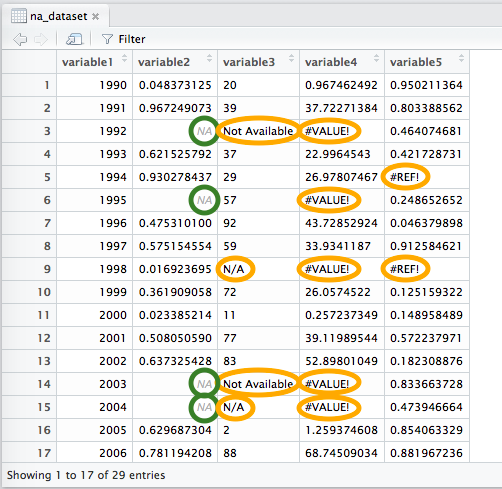
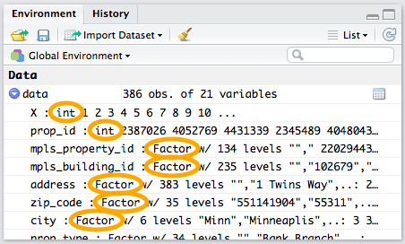

***

**Related to:** _Data Computing_, "From Strings to Numbers", p. 131; "Factors or Strings?", p. 133

***

## Find your data

SOURCES to recommend?

* MN census data

* Gallop

* Hennepin County?


## Skip lines when reading in data (if necessary)

Sometimes datasets come with a few extra lines of information that you don't need.  For example, here's a dataset that contains a few lines of junk at the top.  This will confuse R if we try to read it in directly:

[screenshot of dataset with extra header lines]

One option is to delete these extra lines using a spreadsheet program like Microsoft Excel or Open Office.  _Or_, if you want to save yourself a step, you can simply skip these lines when reading in your data in R.  To skip lines, you can use the `read.csv()` function, but add an argument called `skip` indicating the number of lines to skip when R starts reading in your dataset:

```{r, eval=FALSE}
data <- read.csv("name_of_file.csv", header=TRUE, skip=2)
```


## NA NA NA NA NA NA NA NA...Batman!

```{r, echo=FALSE, eval=FALSE}
na_dataset <- read.csv("../datasets/na_dataset.csv", header=TRUE)

na_dataset <- read.csv("../datasets/na_dataset.csv", header=TRUE, na.strings=c("NA", "N/A", "Not Available", "#VALUE!", "#REF!"))
```

When dealing with a new dataset, you _always_ need to make sure to figure out: **How does the dataset indicate missing values**?  There are lots of different ways datasets can signal which values are missing--and conventions vary a lot across datasets, and even between variables in the _same_ dataset!  So, whenever you encounter a new dataset, you need to go on a quick sleuthing mission to find the missing values.  Here's an easy process to get you started:

1. Use the `read.csv()` function to read in your data.  Anytime R finds a cell that is empty, or a cell that contains the characters "NA" it will add an "NA" to the corresponding cell in R.  

2. Once the dataset is read in, look at it by clicking on its name in the "Environment" tab in RStudio.  Scroll through the dataset to see if there are any additional missing value indicators that R couldn't detect by default.  For example, sometimes datasets use "N/A", "Not Available", "#VALUE!", or other ways of indicating where values are missing.  R will not find these by default.  For example, have a look at this dataset with a ridiculous number of missing values.  In this dataset, it looks like one column has missing values that were recognized correctly, but the other columns' missing values _were not_ properly recognized:



3. Make a note of these additional strings that indicate missing values.  Then, run the `read.csv()` function again, this time adding a new argument: `na.strings`.  Use this `na.strings` argument to list each of these additional missing value strings so R knows to interpret these as "NA" when reading in the data: 

```{r, eval=FALSE}
data <- read.csv("name_of_file.csv", header=TRUE, na.strings=c("NA", "N/A", "Not Available", "#VALUE!", "#REF!"))
```

4. After you've re-run the `read.csv()` function to include all strings that indicate missing values, examine your dataset again.  This time, any missing values should be listed as "NA", and should be greyed out when viewing them in RStudio to indicate that R is properly interpreting these as missing values.  Here's sample datase again, this time with properly-recognized missing values:


## Rename variables

Sometimes, your dataset may include very long and cumbersome variable names.  If this happens, you may be tempted to open up a spreadsheet program like Microsoft Excel or Open Office and start changing the names in your original data file.  But wait!

It is a _much_ better idea to change your variable names _after_ your read the data into R.  This is a good practice to establish a reproducible workflow.  **Reproduciblility** is one important goal of a good data analysis; this simply means that you make sure to document each step of your analysis so that it is easy to backtrack and follow the steps you took at each turn.  Imagine, for example, that you altered your variable names by editing them directly in Excel, changing each variable name to something very simple (for example: "V1", "V2", "V3", etc.).  While it might seem helpful to simplify in this way, it also means that you are deleting some of the information that is contained in the variable name.  Then let's say that, down the road, your share your dataset and analysis with someone who is unfamiliar with the data.  Without the original variable names, they may find it difficult to trace the context of your data and will scratch their heads at what "V1", "V2", and "V3" could possibly stand for!

Instead, keep your original dataset and its variable names intact, and simply change the variable names _after_ you read your data into R.  Then, when writing subsequent R code, you can use these new, more convenient variable names--all _without_ compromising the integrity of the original dataset.

It's very simple to change the names of your data's columns after your dataset is loaded into R.  Simply use the `names()` function, and assign to it a concatenated list `c()` of each of your new variable names, separated by commas:
```{r, eval=FALSE}
names(data) <- c("new_name_var_1", "new_name_var_2", "new_name_var_3", ...)
```

Note: The process above reassigns the names for _all_ of the variables in the dataset.  So, when reassigning names this way, you need to make sure that your list contains a variable name for _each_ column in the dataset.  If your dataset has 20 columns, for example, then your list must contain 20 variable names, all separated by commas.

You can also be a bit more selective if you only want to change the name for _specific_ columns in your dataset.  To change the name of a _single_ column in your dataset, simply find the number of the column you wish to change and put it in brackets ("[]") next to the `names()` argument.  (Note: Columns in R are automatically numbered from left to right starting with the number 1.)  Then, assign to it a new variable name wrapped in quotes ("").  For example, to change the name of the third column, you could do the following:
```{r, eval=FALSE}
names(data)[3] <- "new_name_var_3"
```

#### Pro tip: Don't space out! {.pro-tip}
You may notice that R doesn't like spaces in variable names.  In fact, every time R encounters a space (" ") in a variable name, it will insert a period (".") in its place.  In general, whenever you're using programming languages like R, it's a good practice to avoid using spaces within variable names, as most programming languages don't support spaces as part of variable names.  Instead, you can substitute underscores ("_") for spaces or use camel case variable names (ex: "variableName", "anotherVariableName") instead.


## Check data types for each variable

There is one final step you should take in your data "quality check" before you embark on your data analysis: check to make sure R has assigned the right data type to each column in your dataset.  R's `read.csv()` command does its best to guess the right data type for each column as its reading in the data, but it's never 100% perfect.  To fix R's mistakes, make sure to go through each variable with the `str()` command and check its data type.  Or, for a quicker overview, click the expand arrow next to your dataset name in your R "Environment" tab to check the data type for each variable in the dataset:



You should see that variables with decimal numbers are listed as numeric ("num"); variables with whole numbers, such as years or ages, should be listed as integers ("int").  Variables that are unique strings for each row, such as names and addresses, should be listed as character ("chr") variables.  Other categorical variables should generally be listed as factor ("Factor") _or_ character ("chr") variables.

If you notice that any of your variables seems to be the wrong data type, you can change it very easily using one of the following conversion functions:
```{r, eval=FALSE}
# Change the variable "column_name" in dataset "data" to a character variable
data$column_name <- as.character(data$column_name)

# Change the variable "column_name" in dataset "data" to a numeric variable
data$column_name <- as.numeric(data$column_name)

# Change the variable "column_name" in dataset "data" to an integer variable
data$column_name <- as.integer(data$column_name)

# Change the variable "column_name" in dataset "data" to a factor variable
data$column_name <- as.factor(data$column_name)
```

#### Pro tip: Too many factors! {.pro-tip}
You may notice with some datasets that a lot of your columns got read in as factor variables.  This is a common issue with datasets that contain a lot of character strings (such as names) and categorical variables.  By default, R will try to read in any variable that looks like a **string**--i.e. variables that contain letters and punctuation characters--as factor variables.  In some cases, treating all strings as factors won't make sense as a default.  

If R is treating a column or your data a factor variable when it really should be interpreted as a _character_ variable, you will likely quickly encounter unexpected warnings, or get weird errors in your R console that you aren't expecting.  If this is the case, try converting your factor variables into character variables and see if it resolves the issue.  One simple way to do this is to add the `stringsAsFactors = FALSE` argument as you read in your dataset.  Adding this optional setting  when reading in your data forces R to change its default behavior and treat all string variables as **character** variables instead of **factor** variables:
```{r, eval=FALSE}
data <- read.csv("name_of_file.csv", header=TRUE, stringsAsFactors=FALSE)
```
